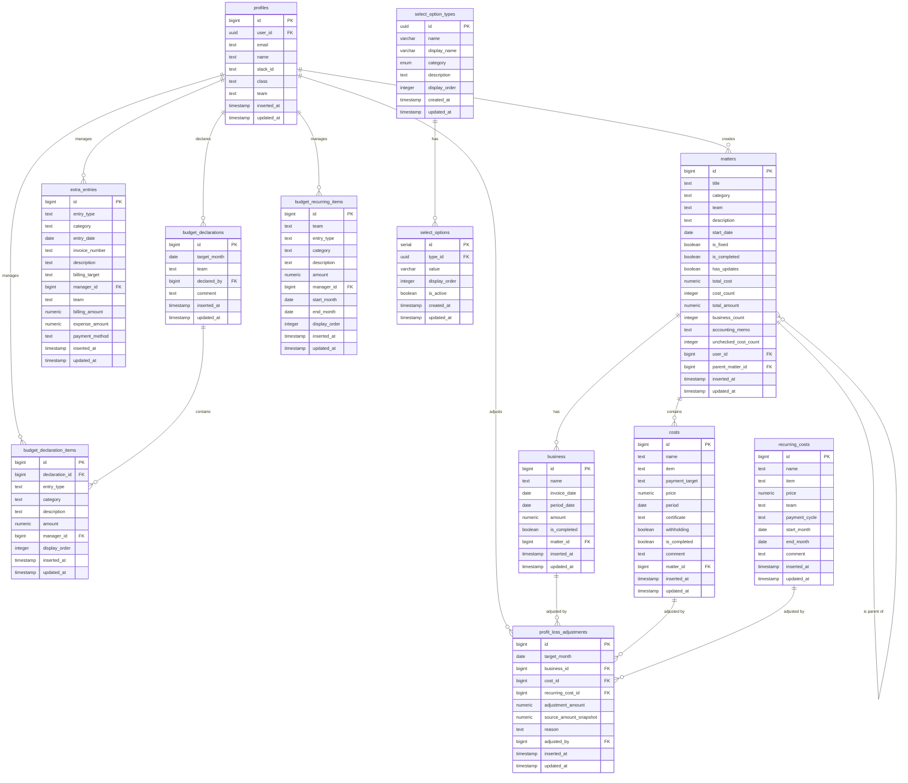

# データベース設計書

## 1. 概要

本設計書は、未来技術推進協会のための経理システムで使用するデータベース設計について記述しています。

### 1.1 使用データベース

- PostgreSQL (Supabase)

### 1.2 スキーマ

- public

### 1.3 タイムゾーン方針

- **セッションタイムゾーンは UTC**（PostgreSQL / Supabase の既定）。`supabase/migrations/` は `ALTER DATABASE ... SET timezone` を含まない。旧ローカル手適用 SQL にあった当該設定は、正であるマイグレーション経路では一度も適用されていなかった。hosted Supabase では `ALTER DATABASE` が失敗しうるため、Phase 0 でも追加しない。
- **`inserted_at` / `updated_at` のカラム DEFAULT と `update_updated_at_column` トリガーは `now()`**（`timestamptz`）である。セッション TZ に依存せず、常に正しい絶対時刻を保存する。`20260830040000_18_fix_timestamp_defaults_to_now.sql` で変更した。
- **変更前は `timezone('Asia/Tokyo'::text, now())`（選択肢マスタは `timezone('utc'::text, now())`）だった。** `timezone(zone, timestamptz)` の戻りは **TZ なし `timestamp`**（そのゾーンの壁時計）であり、これを `timestamptz` 列へ入れると **セッション `TimeZone` のローカル時刻として解釈**される。セッション TZ が UTC のため、`Asia/Tokyo` 指定の列には実際より **約 9 時間後** の絶対時刻が保存されていた（`utc` 指定の列はセッションが UTC のため結果的に正しい値）。
- **既存行のずれはマイグレーション 18 で補正した。** 調査の結果、[#80](https://github.com/Singuralitylabs/accounting-system/issues/80) のカットオーバーで旧 Supabase から移送された行も含め、DEFAULT / トリガー由来の値は一様に +9h ずれていた（旧 DB のセッション TZ も UTC だった）。

  判定は `matters.inserted_at`（アプリが `new Date().toISOString()` で設定＝常に正しい）と `costs.inserted_at`（DEFAULT 由来）の差で行った。案件登録時に両者は同時に書かれるため、その差がずれの大きさになる。実データでは 20 案件中 19 案件が 9 時間差だった。

  ```sql
  WITH first_cost AS (
    SELECT matter_id, min(inserted_at) AS first_inserted_at FROM costs GROUP BY matter_id
  )
  SELECT round(EXTRACT(EPOCH FROM (f.first_inserted_at - m.inserted_at)) / 3600) AS 差_時間,
         count(*) AS 案件数
    FROM first_cost f JOIN matters m ON m.id = f.matter_id
   GROUP BY 1 ORDER BY 1;
  ```

  | 列                                                                                         | 対応                                                                                                                                                                                                                                                                |
  | ------------------------------------------------------------------------------------------ | ------------------------------------------------------------------------------------------------------------------------------------------------------------------------------------------------------------------------------------------------------------------- |
  | `costs` / `business` / `recurring_costs` / `extra_entries` の `inserted_at` / `updated_at` | アプリ側に書き込み経路がなく全行が DEFAULT / トリガー由来のため、**全行を `- interval '9 hours'` で補正**                                                                                                                                                           |
  | `matters.updated_at` / `profiles.updated_at`                                               | アプリは INSERT 時に `inserted_at` と `updated_at` を同じ値で設定するため、両者がほぼ一致する行は未更新（正しい値）。UPDATE を経た行はトリガー由来で `inserted_at` との差が必ず 9 時間以上になる。**`updated_at > inserted_at + interval '1 second'` の行のみ補正** |
  | `matters.inserted_at` / `profiles.inserted_at`                                             | アプリが明示指定するためずれていない。**補正しない**                                                                                                                                                                                                                |
  | `select_option_types` / `select_options` の `created_at` / `updated_at`                    | 旧 DEFAULT が `timezone('utc', ...)` でセッションが UTC のためずれていない。**補正しない**                                                                                                                                                                          |

  補正の `UPDATE` は `BEFORE UPDATE` トリガーを一時的に無効化して実行している。`update_*_updated_at` は `NEW.updated_at` を `now()` で無条件に上書きするため補正値が現在時刻で潰れ、`matters` では `detect_matter_updates` が `has_updates` を立ててしまうためである。

  **残課題**: 上記の判定で差が 0 時間だった 1 案件は、`matters.inserted_at` 自体が DEFAULT 由来（手動投入など）で +9h ずれている可能性がある。機械的に判別できないため補正対象から外している。次の SQL で洗い出して個別に判断すること。

  ```sql
  WITH first_cost AS (
    SELECT matter_id, min(inserted_at) AS first_inserted_at FROM costs GROUP BY matter_id
  )
  SELECT m.id, m.title, m.inserted_at, m.updated_at, f.first_inserted_at
    FROM first_cost f JOIN matters m ON m.id = f.matter_id
   WHERE f.first_inserted_at < m.inserted_at + interval '1 hour';
  ```

- **アドホック SQL で日付境界を切る場合**はセッション TZ に頼らず、`timezone('Asia/Tokyo', ...)` または `AT TIME ZONE 'Asia/Tokyo'` を明示すること。`now()::date` や素の `date_trunc` は UTC 日付になり、JST 0:00〜9:00 で日付がずれる。
- **Vitest** は `vitest.config.ts` で `TZ=Asia/Tokyo` を固定する。Next.js アプリのプロセス TZ は実行環境依存であり、日付表示は `app/utils/formatter.ts` などが `new Date()` のローカル TZ に従う。

## 2. テーブル一覧

| テーブル名                           | 説明                                                                          |
| ------------------------------------ | ----------------------------------------------------------------------------- |
| profiles                             | ユーザー情報を管理するテーブル                                                |
| matters                              | 案件情報を管理するテーブル                                                    |
| costs                                | コスト情報を管理するテーブル                                                  |
| business                             | 取引先情報を管理するテーブル                                                  |
| select_option_types                  | 選択肢の種類を管理するテーブル                                                |
| select_options                       | 選択肢の値を管理するテーブル                                                  |
| recurring_costs                      | 定期費用（管理費）を管理するテーブル                                          |
| extra_entries                        | 経理追加収支（案件に紐づかない収入・支出）を管理するテーブル                  |
| budget_declarations                  | 事前収支申告（チーム×対象月の見込み収支）のヘッダを管理するテーブル           |
| budget_declaration_items             | 事前収支申告の明細（見込み収入・支出の内訳）を管理するテーブル                |
| budget_declaration_reminder_settings | 事前収支申告の未申告 Slack リマインド対象日を管理する設定テーブル（1 行のみ） |
| budget_recurring_items               | 事前収支申告の定期明細（毎月固定の収入・支出）マスタを管理するテーブル        |
| profit_loss_adjustments              | 損益調整（案件・定期費用の実績額修正）を管理するテーブル                      |

## 3. テーブル詳細

### 3.1 profiles テーブル

ユーザー情報を保持するテーブル

| カラム名    | データ型                 | 制約                                                         | 説明                                              |
| ----------- | ------------------------ | ------------------------------------------------------------ | ------------------------------------------------- |
| id          | bigint                   | PRIMARY KEY, GENERATED BY DEFAULT AS IDENTITY                | 主キー                                            |
| user_id     | uuid                     | NOT NULL, UNIQUE, FOREIGN KEY (auth.users) ON DELETE CASCADE | Supabase Auth のユーザー ID                       |
| email       | text                     | NOT NULL                                                     | メールアドレス                                    |
| name        | text                     | NOT NULL                                                     | ユーザー名                                        |
| slack_id    | text                     | NULL                                                         | Slack ID (通知用)                                 |
| class       | text                     | DEFAULT 'public'                                             | ユーザー権限 (public/accounting/admin/teamleader) |
| team        | text                     | NULL                                                         | 所属チーム（teamleader権限時に必要）              |
| inserted_at | timestamp with time zone | NOT NULL, DEFAULT now()                                      | 作成日時                                          |
| updated_at  | timestamp with time zone | NOT NULL, DEFAULT now()                                      | 更新日時                                          |

インデックス:

- user_id

### 3.2 matters テーブル

案件情報を保持するテーブル

| カラム名             | データ型                 | 制約                                                  | 説明               |
| -------------------- | ------------------------ | ----------------------------------------------------- | ------------------ |
| id                   | bigint                   | PRIMARY KEY, GENERATED BY DEFAULT AS IDENTITY         | 主キー             |
| title                | text                     | NOT NULL                                              | 案件名             |
| category             | text                     | NOT NULL                                              | 分類               |
| team                 | text                     | NOT NULL                                              | チーム             |
| description          | text                     | NULL                                                  | 説明               |
| start_date           | date                     | NULL                                                  | 案件開始日         |
| is_fixed             | boolean                  | DEFAULT false                                         | 経理申請済みフラグ |
| is_completed         | boolean                  | DEFAULT false                                         | 経理確認完了フラグ |
| has_updates          | boolean                  | DEFAULT false                                         | 申請後更新フラグ   |
| total_cost           | numeric(15,2)            | DEFAULT 0                                             | 合計コスト         |
| cost_count           | integer                  | DEFAULT 0                                             | コスト数           |
| total_amount         | numeric(15,2)            | DEFAULT 0                                             | 合計請求額         |
| business_count       | integer                  | DEFAULT 0                                             | 取引先数           |
| accounting_memo      | text                     | NULL                                                  | 経理メモ           |
| unchecked_cost_count | integer                  | NOT NULL, DEFAULT 0                                   | 未払いコスト数     |
| user_id              | bigint                   | NOT NULL, FOREIGN KEY (profiles.id) ON DELETE CASCADE | ユーザー ID        |
| parent_matter_id     | bigint                   | NULL, FOREIGN KEY (matters.id) ON DELETE SET NULL     | 親案件 ID          |
| inserted_at          | timestamp with time zone | NOT NULL, DEFAULT now()                               | 作成日時           |
| updated_at           | timestamp with time zone | NOT NULL, DEFAULT now()                               | 更新日時           |

インデックス:

- user_id
- parent_matter_id

### 3.3 costs テーブル

コスト情報を保持するテーブル

| カラム名       | データ型                 | 制約                                                 | 説明             |
| -------------- | ------------------------ | ---------------------------------------------------- | ---------------- |
| id             | bigint                   | PRIMARY KEY, GENERATED ALWAYS AS IDENTITY            | 主キー           |
| name           | text                     | NOT NULL                                             | コスト名         |
| item           | text                     | NOT NULL                                             | 品目             |
| payment_target | text                     | NOT NULL                                             | 支払い先         |
| price          | numeric(15,2)            | NOT NULL                                             | 金額             |
| period         | date                     | NULL                                                 | 支払い期限       |
| certificate    | text                     | NOT NULL                                             | 通知方法         |
| withholding    | boolean                  | NOT NULL, DEFAULT false                              | 源泉徴収フラグ   |
| is_completed   | boolean                  | NOT NULL, DEFAULT false                              | 支払い完了フラグ |
| comment        | text                     | NULL                                                 | コメント         |
| matter_id      | bigint                   | NOT NULL, FOREIGN KEY (matters.id) ON DELETE CASCADE | 案件 ID          |
| inserted_at    | timestamp with time zone | NOT NULL, DEFAULT now()                              | 作成日時         |
| updated_at     | timestamp with time zone | NOT NULL, DEFAULT now()                              | 更新日時         |

インデックス:

- matter_id

### 3.4 business テーブル

取引先情報を保持するテーブル

| カラム名     | データ型                 | 制約                                                 | 説明           |
| ------------ | ------------------------ | ---------------------------------------------------- | -------------- |
| id           | bigint                   | PRIMARY KEY, GENERATED ALWAYS AS IDENTITY            | 主キー         |
| name         | text                     | NOT NULL                                             | 取引先名       |
| invoice_date | date                     | NULL                                                 | 請求日         |
| period_date  | date                     | NULL                                                 | 振込期限       |
| amount       | numeric(15,2)            | NULL                                                 | 報酬額         |
| is_completed | boolean                  | NOT NULL, DEFAULT false                              | 確認完了フラグ |
| matter_id    | bigint                   | NOT NULL, FOREIGN KEY (matters.id) ON DELETE CASCADE | 案件 ID        |
| inserted_at  | timestamp with time zone | NOT NULL, DEFAULT now()                              | 作成日時       |
| updated_at   | timestamp with time zone | NOT NULL, DEFAULT now()                              | 更新日時       |

インデックス:

- matter_id

### 3.5 select_option_types テーブル

選択肢の種類を管理するテーブル

| カラム名      | データ型                 | 制約                                   | 説明                                    |
| ------------- | ------------------------ | -------------------------------------- | --------------------------------------- |
| id            | uuid                     | PRIMARY KEY, DEFAULT gen_random_uuid() | 主キー                                  |
| name          | varchar                  | NOT NULL, UNIQUE                       | 種類名 (team/category/item/certificate) |
| display_name  | varchar                  | NOT NULL                               | 表示名                                  |
| category      | information_category     | NOT NULL                               | カテゴリ (Enum 型)                      |
| description   | text                     | NULL                                   | 説明                                    |
| display_order | integer                  | DEFAULT 0                              | 表示順                                  |
| created_at    | timestamp with time zone | NOT NULL, DEFAULT now()                | 作成日時                                |
| updated_at    | timestamp with time zone | NOT NULL, DEFAULT now()                | 更新日時                                |

### 3.6 select_options テーブル

選択肢の値を管理するテーブル

| カラム名      | データ型                 | 制約                                                   | 説明          |
| ------------- | ------------------------ | ------------------------------------------------------ | ------------- |
| id            | serial                   | PRIMARY KEY                                            | 主キー        |
| type_id       | uuid                     | FOREIGN KEY (select_option_types.id) ON DELETE CASCADE | 選択肢種類 ID |
| value         | varchar                  | NOT NULL                                               | 値            |
| display_order | integer                  | DEFAULT 0                                              | 表示順        |
| is_active     | boolean                  | DEFAULT true                                           | 有効フラグ    |
| created_at    | timestamp with time zone | NOT NULL, DEFAULT now()                                | 作成日時      |
| updated_at    | timestamp with time zone | NOT NULL, DEFAULT now()                                | 更新日時      |

ユニーク制約:

- (type_id, value)

### 3.7 recurring_costs テーブル

定期費用（管理費）を保持するテーブル。定期的にかかる費用を登録し、損益計算書の集計時に支払月（適用開始月を起点に支払サイクル間隔ごと）へ全額算入する（実レコードは月ごとに生成しない）。

| カラム名      | データ型                 | 制約                                                          | 説明                                                     |
| ------------- | ------------------------ | ------------------------------------------------------------- | -------------------------------------------------------- |
| id            | bigint                   | PRIMARY KEY, GENERATED ALWAYS AS IDENTITY                     | 主キー                                                   |
| name          | text                     | NOT NULL                                                      | 名称（例: オフィス家賃）                                 |
| item          | text                     | NOT NULL                                                      | 品目（select_options の item と同じ値域）                |
| price         | numeric(15,2)            | NOT NULL                                                      | 支払額（支払サイクル1回あたり）                          |
| team          | text                     | NULL                                                          | 対象チーム（NULL = 全体共通）                            |
| payment_cycle | text                     | NOT NULL, DEFAULT 'monthly', CHECK (monthly/quarterly/yearly) | 支払サイクル（月払い / 四半期払い / 年払い）             |
| start_month   | date                     | NOT NULL                                                      | 適用開始月 = 最初の支払月（月初日で格納: 例 2026-07-01） |
| end_month     | date                     | NULL                                                          | 適用終了月（月初日で格納。NULL = 継続中。当月を含む）    |
| comment       | text                     | NULL                                                          | コメント                                                 |
| inserted_at   | timestamp with time zone | NOT NULL, DEFAULT now()                                       | 作成日時                                                 |
| updated_at    | timestamp with time zone | NOT NULL, DEFAULT now()                                       | 更新日時                                                 |

インデックス:

- team
- start_month

### 3.8 extra_entries テーブル

経理追加収支（案件に紐づかない収入・支出）を保持するテーブル。損益計算書の集計時に entry_date（日付）の属する月へ算入する（収入の請求額 → 売上合計、経費 → 案件費用合計。日付未入力は月未確定）。金額はマイナスを許容し、損益計算書上での減額調整に使う。

| カラム名       | データ型                 | 制約                                                                      | 説明                                                                                 |
| -------------- | ------------------------ | ------------------------------------------------------------------------- | ------------------------------------------------------------------------------------ |
| id             | bigint                   | PRIMARY KEY, GENERATED ALWAYS AS IDENTITY                                 | 主キー                                                                               |
| entry_type     | text                     | NOT NULL, CHECK (entry_type IN ('income', 'expense'))                     | 種別（income = 収入 / expense = 支出）                                               |
| category       | text                     | NOT NULL                                                                  | 分類（収入時は extra_income_category、支出時は extra_expense_category マスタの値域） |
| entry_date     | date                     | NULL                                                                      | 日付（損益計算書の計上月の判定に使用。NULL = 月未確定）                              |
| invoice_number | text                     | NULL                                                                      | 請求書番号（収入時のみ）                                                             |
| description    | text                     | NOT NULL                                                                  | 内容                                                                                 |
| billing_target | text                     | NULL                                                                      | 請求先（収入時のみ）                                                                 |
| manager_id     | bigint                   | NOT NULL, FOREIGN KEY (profiles.id)（参照アクション指定なし = NO ACTION） | 責任者（メンバー）                                                                   |
| team           | text                     | NULL                                                                      | 対象チーム（NULL = 全体共通）                                                        |
| billing_amount | numeric(15,2)            | NULL, CHECK (billing_amount <> 0)                                         | 請求額（円・税別。マイナス可・0 不可。収入時のみ）                                   |
| expense_amount | numeric(15,2)            | NULL, CHECK (expense_amount <> 0)                                         | 経費（円・税別。マイナス可・0 不可。収入時は任意、支出時は必須）                     |
| payment_method | text                     | NULL                                                                      | 決済方法（payment_method マスタの値域。支出時のみ）                                  |
| inserted_at    | timestamp with time zone | NOT NULL, DEFAULT now()                                                   | 作成日時                                                                             |
| updated_at     | timestamp with time zone | NOT NULL, DEFAULT now()                                                   | 更新日時                                                                             |

CHECK 制約（種別ごとの項目の整合性）:

```sql
-- 収入: 請求額必須・決済方法なし / 支出: 経費・決済方法必須、収入専用項目（請求書番号・請求先・請求額）なし
CHECK (
    (entry_type = 'income' AND billing_amount IS NOT NULL AND payment_method IS NULL) OR
    (entry_type = 'expense' AND expense_amount IS NOT NULL AND payment_method IS NOT NULL
        AND billing_amount IS NULL AND invoice_number IS NULL AND billing_target IS NULL)
)
```

インデックス:

- team
- entry_date
- manager_id

### 3.9 budget_declarations テーブル

事前収支申告のヘッダ。各チームのチームリーダーが翌月のチーム収支（見込み収入・見込み支出）を申告するために使う。1 チーム × 1 対象月につき 1 行。

合計金額はヘッダに非正規化せず、`budget_declaration_items` から集計する（案件の `total_cost` と異なり明細数が小さいため）。

| カラム名     | データ型                 | 制約                                                                      | 説明                                                                                                                                                                                                                                                        |
| ------------ | ------------------------ | ------------------------------------------------------------------------- | ----------------------------------------------------------------------------------------------------------------------------------------------------------------------------------------------------------------------------------------------------------- |
| id           | bigint                   | PRIMARY KEY, GENERATED ALWAYS AS IDENTITY                                 | 主キー                                                                                                                                                                                                                                                      |
| target_month | date                     | NOT NULL, CHECK (月初日であること)                                        | 対象月（月初日で格納: 例 2026-10-01。recurring_costs と同方式）                                                                                                                                                                                             |
| team         | text                     | NOT NULL                                                                  | 対象チーム（select_options の team と同じ値域）                                                                                                                                                                                                             |
| declared_by  | bigint                   | NOT NULL, FOREIGN KEY (profiles.id)（参照アクション指定なし = NO ACTION） | 申告者（最終更新したチームリーダー等）。extra_entries.manager_id と同じく CASCADE にしない（リーダーの退会でチームの申告ごと消えるのを避ける）。申告のある profiles を削除するとこの FK でエラーになるため、先に declared_by を別のメンバーに付け替えること |
| comment      | text                     | NULL                                                                      | 補足コメント                                                                                                                                                                                                                                                |
| inserted_at  | timestamp with time zone | NOT NULL, DEFAULT now()                                                   | 作成日時                                                                                                                                                                                                                                                    |
| updated_at   | timestamp with time zone | NOT NULL, DEFAULT now()                                                   | 更新日時                                                                                                                                                                                                                                                    |

CHECK 制約（対象月の正規化）:

```sql
-- 月初日以外を弾く。これが無いと 2026-10-01 と 2026-10-05 が別行として登録でき、
-- 下の UNIQUE (target_month, team) が「1 チーム × 1 対象月」を担保できない
CHECK (target_month = date_trunc('month', target_month)::date)
```

UNIQUE 制約:

- `(target_month, team)`（`budget_declarations_target_month_team_key`）

インデックス:

- team
- declared_by（FK 側の索引。extra_entries.manager_id と同じ方針）
- （target_month 単独のインデックスは張らない。UNIQUE 制約のインデックスが `(target_month, team)` で target_month を先頭列に持つため、対象月での絞り込みはそちらが使える）

`team` の運用上の注意:

`team` は既存テーブルと同じく自由テキストで、DB 側の値域制約は無い。ただしこのテーブルでは `team` が UNIQUE 制約の一部であり、かつ RLS の判定キーでもあるため、表記ゆれやチーム名の変更が「同一対象月に実質重複したヘッダができる」「過去の申告がそのチームのリーダーから見えなくなる」に直結する。`target_month` は CHECK で正規化を強制しているが `team` は非対称に無防備なので、**チーム名を変更する際は select_options だけでなく本テーブル（と profiles.team）の既存行もあわせて更新すること。**

### 3.10 budget_declaration_items テーブル

事前収支申告の明細。1 ヘッダに対して収入・支出の内訳を複数行持つ。

| カラム名       | データ型                 | 制約                                                                  | 説明                                                                                                                                                                                                                                                                                                                                                                  |
| -------------- | ------------------------ | --------------------------------------------------------------------- | --------------------------------------------------------------------------------------------------------------------------------------------------------------------------------------------------------------------------------------------------------------------------------------------------------------------------------------------------------------------- |
| id             | bigint                   | PRIMARY KEY, GENERATED ALWAYS AS IDENTITY                             | 主キー                                                                                                                                                                                                                                                                                                                                                                |
| declaration_id | bigint                   | NOT NULL, FOREIGN KEY (budget_declarations.id) ON DELETE CASCADE      | 申告ヘッダ ID（ヘッダ削除時に明細も削除される）                                                                                                                                                                                                                                                                                                                       |
| entry_type     | text                     | NOT NULL, CHECK (entry_type IN ('income', 'expense'))                 | 種別（income = 収入 / expense = 支出。extra_entries と同じ値域）                                                                                                                                                                                                                                                                                                      |
| category       | text                     | NOT NULL                                                              | 分類（収入時は案件分類 category、支出時は品目 item マスタの値域を想定）                                                                                                                                                                                                                                                                                               |
| description    | text                     | NOT NULL                                                              | 内容（例: ○○受託案件、外注費）                                                                                                                                                                                                                                                                                                                                        |
| amount         | numeric(15,2)            | NOT NULL, CHECK (amount > 0)                                          | 見込み金額（円・税別。正の値のみ）                                                                                                                                                                                                                                                                                                                                    |
| manager_id     | bigint                   | NULL, FOREIGN KEY (profiles.id)（参照アクション指定なし = NO ACTION） | 明細（収入・支出）ごとの担当者。メンバー（profiles）から任意選択、NULL 許容（既存明細はバックフィルせず NULL のまま）。declared_by / extra_entries.manager_id と同じく CASCADE にしない（担当者の退会で明細が消えるのを避ける）。担当者に設定された profiles を削除するとこの FK でエラーになるため、先に manager_id を別のメンバーに付け替えるか NULL に解除すること |
| display_order  | integer                  | NOT NULL, DEFAULT 0                                                   | 表示順                                                                                                                                                                                                                                                                                                                                                                |
| inserted_at    | timestamp with time zone | NOT NULL, DEFAULT now()                                               | 作成日時                                                                                                                                                                                                                                                                                                                                                              |
| updated_at     | timestamp with time zone | NOT NULL, DEFAULT now()                                               | 更新日時                                                                                                                                                                                                                                                                                                                                                              |

インデックス:

- declaration_id
- manager_id（FK 側の索引。extra_entries.manager_id / budget_declarations.declared_by と同じ方針）

### 3.11 budget_declaration_reminder_settings テーブル

事前収支申告の未申告 Slack リマインド（`app/api/cron/budget-declaration-reminder/route.ts`）の対象日を保持する設定テーブル。1 行のみを持つシングルトンで、`id` は `1` に固定する（CHECK 制約）。対象日リストをデプロイなしで編集できるようにする（Issue #94）。

| カラム名    | データ型                 | 制約                                                   | 説明                                                                                                                                                                                    |
| ----------- | ------------------------ | ------------------------------------------------------ | --------------------------------------------------------------------------------------------------------------------------------------------------------------------------------------- |
| id          | smallint                 | PRIMARY KEY, DEFAULT 1, CHECK (id = 1)                 | シングルトン強制用の固定 ID                                                                                                                                                             |
| target_days | smallint[]               | NOT NULL, DEFAULT '{15,18,20}', CHECK (各要素が 1〜31) | リマインド対象日（JST の日）。**空配列にするとリマインド停止**（`isBudgetDeclarationReminderTargetDay` が常に false を返す）。移行時点の初期値は従来のハードコード値と同じ `{15,18,20}` |
| updated_at  | timestamp with time zone | NOT NULL, DEFAULT now()                                | 更新日時                                                                                                                                                                                |

CHECK 制約（対象日の範囲検証）:

```sql
-- 編集手段が RLS をバイパスする Supabase ダッシュボード直編集のため、
-- typo（0 や 32 等）による無言のリマインド停止を防ぐ DB 層での検証
CHECK (1 <= ALL(target_days) AND 31 >= ALL(target_days))
```

読み取り: cron ルートは `app/utils/supabase/budgetDeclarationReminderData.ts` の `getBudgetDeclarationReminderTargetDays()` で取得する。**取得失敗（DB エラー・行が存在しない・`createServiceRoleSupabase()` が投げる例外を含む）の場合は `app/utils/budgetDeclarationReminder.ts` の `DEFAULT_BUDGET_DECLARATION_REMINDER_TARGET_DAYS`（`[15, 18, 20]`）にフォールバックし、リマインドが無応答で止まらないようにする。** このフォールバックは「対象日を空にして意図的に停止した」状態でも取得が一時的に失敗すればデフォルト値に戻ってしまう trade-off を内包するが、cron を無応答で止めないことを優先している（fail-open）。

編集: `/budget-declarations`（事前収支申告画面）の「リマインド設定」セクションから admin / accounting が編集できる（Issue #97）。`app/utils/supabase/budgetDeclarationReminderSettings.ts` の `getBudgetDeclarationReminderSettings()` / `updateBudgetDeclarationReminderTargetDays()`（いずれも Server Action）を使い、`createServerSupabase()`（anon キー + RLS）経由で `getAuthorizedViewer(["admin", "accounting"], ...)` による多層防御を行う（service role クライアントは使わない）。保存対象は `id = 1` の既存行への UPDATE のみ（RLS 上 INSERT / DELETE は不可）。保存前に `app/utils/budgetDeclarationReminder.ts` の `normalizeBudgetDeclarationReminderTargetDays`（範囲チェック / 重複排除 / 昇順ソート）で正規化する。teamleader / public にはセクション自体を描画せず、Server Action 側でも `getAuthorizedViewer` により拒否する。

### 3.12 budget_recurring_items テーブル

事前収支申告の定期明細マスタ。毎月固定で発生する収入・支出（例: 保守契約の月額収入、固定の外注費・ツール利用料）を登録し、対象月が適用期間内であれば新規の事前収支申告を作成したときに `budget_declaration_items` として展開する（Issue #109）。`recurring_costs`（損益計算書の集計時に計算で算入する）と異なり、本テーブル自体は集計に使わない。展開後の行は通常の申告明細と同じく個別に編集・削除でき、本テーブルの内容は変更されない。

| カラム名      | データ型                 | 制約                                                                  | 説明                                                                                                                                                                                                                      |
| ------------- | ------------------------ | --------------------------------------------------------------------- | ------------------------------------------------------------------------------------------------------------------------------------------------------------------------------------------------------------------------- |
| id            | bigint                   | PRIMARY KEY, GENERATED ALWAYS AS IDENTITY                             | 主キー                                                                                                                                                                                                                    |
| team          | text                     | NOT NULL                                                              | 対象チーム（select_options の team と同じ値域。budget_declarations と同じ運用上の注意が当てはまる）                                                                                                                       |
| entry_type    | text                     | NOT NULL, CHECK (entry_type IN ('income', 'expense'))                 | 種別（income = 収入 / expense = 支出。budget_declaration_items と同じ値域）                                                                                                                                               |
| category      | text                     | NOT NULL                                                              | 分類（収入時は案件分類 category、支出時は品目 item マスタの値域を想定。budget_declaration_items と同じ）                                                                                                                  |
| description   | text                     | NOT NULL                                                              | 内容（例: ○○保守契約、外注費）                                                                                                                                                                                            |
| amount        | numeric(15,2)            | NOT NULL, CHECK (amount > 0)                                          | 毎月の金額（円・税別。正の値のみ）                                                                                                                                                                                        |
| manager_id    | bigint                   | NULL, FOREIGN KEY (profiles.id)（参照アクション指定なし = NO ACTION） | 明細の担当者。budget_declaration_items.manager_id と同じ方針（任意選択・NULL 許容。担当者に設定された profiles を削除するとこの FK でエラーになるため、先に manager_id を別のメンバーに付け替えるか NULL に解除すること） |
| start_month   | date                     | NOT NULL, CHECK (月初日であること)                                    | 適用開始月（月初日で格納。recurring_costs.start_month / budget_declarations.target_month と同方式）                                                                                                                       |
| end_month     | date                     | NULL, CHECK (月初日であること), CHECK (start_month 以降であること)    | 適用終了月（その月を含む。NULL = 継続中。recurring_costs.end_month と同方式）                                                                                                                                             |
| display_order | integer                  | NOT NULL, DEFAULT 0                                                   | 表示順。新規申告への展開時、この順で `budget_declaration_items.display_order` に引き継がれる                                                                                                                              |
| inserted_at   | timestamp with time zone | NOT NULL, DEFAULT now()                                               | 作成日時                                                                                                                                                                                                                  |
| updated_at    | timestamp with time zone | NOT NULL, DEFAULT now()                                               | 更新日時                                                                                                                                                                                                                  |

CHECK 制約（適用期間の正規化・整合性）:

```sql
-- start_month / end_month とも月初日以外を弾く（budget_declarations.target_month と同じ理由）
CHECK (start_month = date_trunc('month', start_month)::date)
CHECK (end_month IS NULL OR end_month = date_trunc('month', end_month)::date)
-- 適用終了月が適用開始月より前という矛盾した期間を作れないようにする
CHECK (end_month IS NULL OR end_month >= start_month)
```

インデックス:

- (team, start_month, end_month)（新規申告作成時に「対象月を適用期間に含む」行を team で絞って探すクエリを支える複合インデックス。team 単体の絞り込みもこの索引が先頭列として使えるため、team 単独の索引は別途張らない）
- manager_id（FK 側の索引。budget_declaration_items.manager_id と同じ方針）

金額改定の運用は recurring_costs と同じ（既存行の end_month を設定して打ち切り、新しい行を追加する。過去に展開済みの budget_declaration_items は遡って変わらない）。

### 3.13 profit_loss_adjustments テーブル

損益調整。損益計算書（/profit-loss）の売上・案件費用・管理費が実際の入金・支払額と一致しない場合に、経理担当者・管理者が対象月ごとの実績額へ修正できるようにするテーブル（Issue #108）。元データ（business / costs / recurring_costs）は書き換えず、対象行 × 対象月ごとの差分（`adjustment_amount`）だけを保持し、損益計算書では「元データ + 調整 = 実績」として表示・集計する。business / costs は案件ライフサイクル・差し戻し検知の対象であり経理が直接書き換えると担当者の見ている案件が変わってしまう、recurring_costs は適用期間で全月に反映されるため金額欄を直すと全月が変わってしまう、という理由から元データを直接編集する方式は採らない。

| カラム名               | データ型                 | 制約                                                                      | 説明                                                                                                                                                                                                    |
| ---------------------- | ------------------------ | ------------------------------------------------------------------------- | ------------------------------------------------------------------------------------------------------------------------------------------------------------------------------------------------------- |
| id                     | bigint                   | PRIMARY KEY, GENERATED ALWAYS AS IDENTITY                                 | 主キー                                                                                                                                                                                                  |
| target_month           | date                     | NOT NULL, CHECK (月初日であること)                                        | 調整を効かせる対象月（月初日で格納。budget_declarations.target_month と同方式）                                                                                                                         |
| business_id            | bigint                   | NULL, FOREIGN KEY (business.id) ON DELETE CASCADE                         | 調整対象（案件の売上）。business_id / cost_id / recurring_cost_id のうちちょうど1つが NOT NULL                                                                                                          |
| cost_id                | bigint                   | NULL, FOREIGN KEY (costs.id) ON DELETE CASCADE                            | 調整対象（案件費用）                                                                                                                                                                                    |
| recurring_cost_id      | bigint                   | NULL, FOREIGN KEY (recurring_costs.id) ON DELETE CASCADE                  | 調整対象（管理費）                                                                                                                                                                                      |
| adjustment_amount      | numeric(15,2)            | NOT NULL, CHECK (adjustment_amount <> 0)                                  | 実績額と元データ金額の差分（実績額 − 保存時点の元データ金額）。マイナス可。0 は許可しない（実績額が元データと同額になった場合はレコード自体を削除する）                                                 |
| source_amount_snapshot | numeric(15,2)            | NOT NULL                                                                  | 保存時点の元データ金額。元データ変更検知用（現在の元データ金額との比較にのみ使う。実績額の計算には現在の元データ金額 + adjustment_amount を使う）                                                       |
| reason                 | text                     | NOT NULL, CHECK (空白のみを除いて空でないこと)                            | 調整理由                                                                                                                                                                                                |
| adjusted_by            | bigint                   | NOT NULL, FOREIGN KEY (profiles.id)（参照アクション指定なし = NO ACTION） | 調整した経理担当者・管理者。budget_declarations.declared_by 等と同じ方針（担当者に設定された profiles を削除しようとするとこの FK でエラーになるため、先に adjusted_by を別のメンバーに付け替えること） |
| inserted_at            | timestamp with time zone | NOT NULL, DEFAULT now()                                                   | 作成日時                                                                                                                                                                                                |
| updated_at             | timestamp with time zone | NOT NULL, DEFAULT now()                                                   | 更新日時                                                                                                                                                                                                |

CHECK 制約:

```sql
-- target_month は月初日以外を弾く（budget_declarations.target_month と同じ理由）
CHECK (target_month = date_trunc('month', target_month)::date)
-- 0 の調整は保存しない（実績額が元データと同額なら削除する運用のため）
CHECK (adjustment_amount <> 0)
-- ポリモーフィック参照にせず実 FK を3本張るため、対象は必ずちょうど1つに限定する
-- （0個だと調整対象が無い、2個以上だと元データ変更検知がどの行を指すか決まらない）
CHECK (num_nonnulls(business_id, cost_id, recurring_cost_id) = 1)
-- 空文字の理由を保存させない（アプリ側でも必須入力にしているが、DB 側でも担保する）
CHECK (btrim(reason) <> '')
```

UNIQUE 制約（部分インデックス。対象行 × 対象月は1件に限定する）:

```sql
-- 各インデックスの先頭列を FK 列にしているため、対象行削除時の CASCADE 検索・
-- Supabase の unindexed_foreign_keys リンタの両方をこれで満たす（下記インデックス欄参照）
CREATE UNIQUE INDEX ... ON profit_loss_adjustments (business_id, target_month) WHERE business_id IS NOT NULL;
CREATE UNIQUE INDEX ... ON profit_loss_adjustments (cost_id, target_month) WHERE cost_id IS NOT NULL;
CREATE UNIQUE INDEX ... ON profit_loss_adjustments (recurring_cost_id, target_month) WHERE recurring_cost_id IS NOT NULL;
```

インデックス:

- (business_id, target_month) / (cost_id, target_month) / (recurring_cost_id, target_month)（上記の部分 UNIQUE インデックス。FK 列が先頭列のため、対象行削除時の CASCADE 検索・FK 側の索引を兼ねる）
- adjusted_by（FK 側の索引。extra_entries.manager_id と同じ方針）
- target_month 単独の索引は張らない（budget_declarations と同じ理由。損益計算書は業務データを全件取得し、月ごとの振り分けをアプリ側のメモリ上で行うため、target_month 単体の絞り込みクエリは発生しない）

運用上の注意:

- 実績額の入力は損益計算書（/profit-loss）の各明細行の「実績額を修正」操作から行う。入力は実績額のみで、保存は DB 関数 `public.save_profit_loss_adjustment`（[5.12](#512-profit_loss_adjustments-テーブル)）を1回呼ぶだけで完結する。対象行を `FOR UPDATE` でロックしたうえで `adjustment_amount = 実績額 − 元データ金額` を計算し、`source_amount_snapshot` に同じ元データ金額を保存する（`app/utils/supabase/profitLossAdjustments.ts`）。取得から書き込みまでを単一トランザクションで行うため、保存の途中で元データが変わる・複数人が同時に同じ対象へ保存するといった競合が起きない
- 元データ変更の検知: 表示時に現在の元データ金額と `source_amount_snapshot` が異なる場合、画面に警告を表示する。本テーブルの値は自動では追従しない（経理が再確認して実績額を更新するか、調整自体を削除する）
- 対象行が別の月に移動した場合（案件の請求日変更等）: 調整は `target_month` に留まるため、その月の集計対象に対象行が無ければ「対象行が当月に存在しません」として損益には反映せず、削除を促す警告を表示する（`app/utils/profitLossLogic.ts` の `orphanedAdjustments`）
- 対象行そのものが削除された場合は ON DELETE CASCADE により調整も自動的に削除される

## 4. 列挙型

### 4.1 information_category

情報カテゴリの列挙型

| 値            | 説明       |
| ------------- | ---------- |
| basic_info    | 基本情報   |
| business_info | 取引先情報 |
| cost_info     | コスト情報 |

## 5. Row Level Security (RLS)

### 5.0 テーブル / シーケンス権限（PostgREST の前提）

RLS は行スコープのゲートであり、テーブルに対する `GRANT SELECT / INSERT / UPDATE / DELETE` が無いと PostgREST は RLS を評価する前に HTTP 403 を返す。

現行のローカル Supabase Postgres イメージは `public` スキーマの DEFAULT PRIVILEGES が厳格化されており、マイグレーションの `CREATE TABLE` だけでは `anon` / `authenticated` / `service_role` に CRUD が付かない（付くのは `TRUNCATE` / `REFERENCES` / `TRIGGER` / `MAINTAIN` のみ）。`supabase/migrations/20260826000000_17_grant_public_crud.sql` で標準的なテーブル / シーケンス GRANT と DEFAULT PRIVILEGES を明示する。関数の `EXECUTE` は付与しない（migration 15/16 の `custom_access_token_hook` 制限を維持する）。

`supabase db reset` はこのマイグレーションを含めて再適用するため、リセット後も PostgREST が 403 に戻らない。

migration 17 以降に追加するテーブルは、同マイグレーションの `ALTER DEFAULT PRIVILEGES` で自動的に同じ権限が付くが、DEFAULT PRIVILEGES の設定差で 403 に戻らないよう、新規テーブルのマイグレーション内でも `GRANT` を明示する（例: `20260830050000_19_budget_declarations.sql`）。

あわせて、`anon`（未ログイン）が触る必要のないテーブルでは自動付与された権限を `REVOKE ALL ... FROM anon` で剥奪する。migration 17 は既存テーブルの 403 障害に対する一括付与であり、新規テーブルで未ログインに CRUD を残す必然性は無い。RLS だけをゲートにしておくと、将来 `TO anon` のポリシーを足したり調査目的で RLS を外したりした瞬間にフル CRUD が開いてしまう。

### 5.1 profiles テーブル

> パフォーマンス最適化のため、`auth.uid()` は `(select auth.uid())` でラップして 1 行ごとの再評価を避けている（Supabase Linter `auth_rls_initplan` 対応）。

> SELECT は「自分 / 経理・管理者 / 同チームのチームリーダー」に限定している（旧 `USING (true)` では全ログインユーザーが他人の email・class 等を読めたため）。閲覧者自身の `class` / `team` を SELECT ポリシー内で参照すると profiles への再帰参照で無限再帰になるため、`SECURITY DEFINER` のヘルパ関数（`auth_user_class()` / `auth_user_team()`、RLS をバイパスして自分の 1 行のみ読む）経由で取得する。

```sql
-- 閲覧者自身の class / team を RLS バイパスで取得するヘルパ（再帰回避用）
CREATE OR REPLACE FUNCTION public.auth_user_class()
RETURNS text LANGUAGE sql SECURITY DEFINER STABLE SET search_path = ''
AS $$ SELECT class FROM public.profiles WHERE user_id = (select auth.uid()) LIMIT 1 $$;

CREATE OR REPLACE FUNCTION public.auth_user_team()
RETURNS text LANGUAGE sql SECURITY DEFINER STABLE SET search_path = ''
AS $$ SELECT team FROM public.profiles WHERE user_id = (select auth.uid()) LIMIT 1 $$;

-- ヘルパ関数は認証済みロールのみ実行可能（不特定多数からの直接呼び出しを防ぐ）
REVOKE EXECUTE ON FUNCTION public.auth_user_class() FROM PUBLIC;
REVOKE EXECUTE ON FUNCTION public.auth_user_team() FROM PUBLIC;
GRANT EXECUTE ON FUNCTION public.auth_user_class() TO authenticated;
GRANT EXECUTE ON FUNCTION public.auth_user_team() TO authenticated;

-- 自分 / 経理・管理者 / 同チームのチームリーダーのみ参照可能
CREATE POLICY "Users can view own profile"
  ON profiles
  FOR SELECT
  TO authenticated
  USING (
    user_id = (select auth.uid())
    OR public.auth_user_class() IN ('admin', 'accounting')
    OR (
      public.auth_user_class() = 'teamleader'
      AND public.auth_user_team() IS NOT NULL
      AND profiles.team = public.auth_user_team()
    )
  );

-- 自分自身のプロフィールのみ挿入可能
CREATE POLICY "Users can insert own profile"
  ON profiles
  FOR INSERT
  TO authenticated
  WITH CHECK ((select auth.uid()) = user_id);

-- 自分自身のプロフィールまたは管理者が更新可能。
-- WITH CHECK で更新後の値も制約し、admin 以外による class/team/user_id の改変
-- （自己昇格・所有者付け替え）を防ぐ。
CREATE POLICY "Users can update own profile or admin can update any profile"
  ON profiles
  FOR UPDATE
  TO authenticated
  USING (
    user_id = (select auth.uid())
    OR public.auth_user_class() = 'admin'
  )
  WITH CHECK (
    public.auth_user_class() = 'admin'
    OR (
      user_id = (select auth.uid())
      AND class IS NOT DISTINCT FROM public.auth_user_class()
      AND team  IS NOT DISTINCT FROM public.auth_user_team()
    )
  );
```

#### 担当者選択肢用の関数（get_member_options）

事前収支申告の明細担当者（`budget_declaration_items.manager_id`）は、選択肢を全メンバーとする（[3.10](#310-budget_declaration_items-テーブル)、Issue #112）。しかし `/budget-declarations` は teamleader もアクセスでき、上記 SELECT ポリシーでは teamleader は自チームの行しか読めないため、`profiles` への直接 SELECT では全メンバー一覧を取得できない。

`auth_user_class()` / `auth_user_team()` と同じ `SECURITY DEFINER` パターンで RLS をバイパスするが、返すのは `id` / `name` のみとし、SELECT ポリシーが保護する `email` / `slack_id` / `class` / `team` 等は含めない。

`GRANT EXECUTE ... TO authenticated` だけでは関数内にロール判定が無く、PostgREST の RPC エンドポイントはテーブルの RLS ポリシーとは独立に公開されるため、`public` クラスのユーザーもアプリのルートガードを経由せず直接呼び出せてしまう（migration 12 が防いだ「public を含む全ログインユーザーが他人の情報を読める」を id/name について再び開けてしまう）。そのため呼び出し可能ロールを関数内で `/budget-declarations` の許可ロール（teamleader / accounting / admin）に絞り、それ以外のロールから呼ばれた場合は 0 行を返す。

```sql
CREATE OR REPLACE FUNCTION public.get_member_options()
RETURNS TABLE(id bigint, name text)
LANGUAGE sql STABLE SECURITY DEFINER SET search_path = ''
AS $$
  SELECT profiles.id, profiles.name FROM public.profiles
  WHERE public.auth_user_class() IN ('teamleader', 'accounting', 'admin')
  ORDER BY profiles.id
$$;

REVOKE EXECUTE ON FUNCTION public.get_member_options() FROM PUBLIC;
GRANT EXECUTE ON FUNCTION public.get_member_options() TO authenticated;
```

#### 担当者保存前検証用の関数（validate_member_ids）

事前収支申告の保存（明細差し替え）は非トランザクション（既存明細を全 DELETE → INSERT）のため、フォーム表示後に担当者の `profiles` が削除される等で存在しない `manager_id` が保存されようとすると、DELETE 成功後の INSERT が FK 違反（23503）で失敗し、既存明細が消えたまま保存が中断する。保存前に渡された `manager_id` が実在するか確認する必要がある。

`get_member_options()` で全メンバーを取得して JS 側で照合することもできるが、保存のたびに全メンバー分の行を転送するのは無駄（メンバー数が増えるほど悪化する）。渡された id 集合だけを DB 側で照合し、実在する id のみを返す。ロール制限は `get_member_options()` と同じ（teamleader / accounting / admin のみ。それ以外は 0 行）。

```sql
CREATE OR REPLACE FUNCTION public.validate_member_ids(target_ids bigint[])
RETURNS TABLE(id bigint)
LANGUAGE sql STABLE SECURITY DEFINER SET search_path = ''
AS $$
  SELECT profiles.id FROM public.profiles
  WHERE public.auth_user_class() IN ('teamleader', 'accounting', 'admin')
    AND profiles.id = ANY(target_ids)
$$;

REVOKE EXECUTE ON FUNCTION public.validate_member_ids(bigint[]) FROM PUBLIC;
GRANT EXECUTE ON FUNCTION public.validate_member_ids(bigint[]) TO authenticated;
```

### 5.2 matters テーブル

```sql
-- 自身の案件または経理担当者/管理者/同チームのチームリーダーが参照可能
CREATE POLICY "matters_select_policy" ON matters
    FOR SELECT
    TO authenticated
    USING (
        EXISTS (
            SELECT 1 FROM profiles
            WHERE profiles.id = matters.user_id
            AND profiles.user_id = (select auth.uid())
        ) OR
        EXISTS (
            SELECT 1 FROM profiles
            WHERE profiles.user_id = (select auth.uid())
            AND profiles.class IN ('admin', 'accounting')
        ) OR
        EXISTS (
            SELECT 1 FROM profiles
            WHERE profiles.user_id = (select auth.uid())
            AND profiles.class = 'teamleader'
            AND profiles.team IS NOT NULL
            AND profiles.team = matters.team
        )
    );

-- 自身の案件のみ挿入可能
CREATE POLICY "matters_insert_policy" ON matters
    FOR INSERT
    TO authenticated
    WITH CHECK (
        EXISTS (
            SELECT 1 FROM profiles
            WHERE profiles.id = matters.user_id
            AND profiles.user_id = (select auth.uid())
        )
    );

-- 自身の案件または経理担当者/管理者が更新可能
-- 経理申請済の案件も編集可能にする（has_updatesフラグを設定）
CREATE POLICY "matters_update_policy" ON matters
    FOR UPDATE
    TO authenticated
    USING (
        EXISTS (
            SELECT 1 FROM profiles
            WHERE profiles.id = matters.user_id
            AND profiles.user_id = (select auth.uid())
        ) OR
        EXISTS (
            SELECT 1 FROM profiles
            WHERE profiles.user_id = (select auth.uid())
            AND profiles.class IN ('admin', 'accounting')
        )
    );

-- 自身の案件または管理者が削除可能
CREATE POLICY "matters_delete_policy" ON matters
    FOR DELETE
    TO authenticated
    USING (
        EXISTS (
            SELECT 1 FROM profiles
            WHERE profiles.id = matters.user_id
            AND profiles.user_id = (select auth.uid())
        ) OR
        EXISTS (
            SELECT 1 FROM profiles
            WHERE profiles.user_id = (select auth.uid())
            AND profiles.class = 'admin'
        )
    );
```

### 5.3 costs テーブル

```sql
-- 自身の案件に関連するコスト、同チームのチームリーダー、または経理担当者/管理者が参照可能
CREATE POLICY "costs_select_policy" ON costs
    FOR SELECT
    TO authenticated
    USING (
        EXISTS (
            SELECT 1 FROM matters
            JOIN profiles ON profiles.id = matters.user_id
            WHERE matters.id = costs.matter_id
            AND profiles.user_id = (select auth.uid())
        ) OR
        EXISTS (
            SELECT 1 FROM profiles
            WHERE profiles.user_id = (select auth.uid())
            AND profiles.class IN ('admin', 'accounting')
        ) OR
        EXISTS (
            SELECT 1 FROM profiles cu, matters
            WHERE matters.id = costs.matter_id
            AND cu.user_id = (select auth.uid())
            AND cu.class = 'teamleader'
            AND cu.team IS NOT NULL
            AND cu.team = matters.team
        )
    );

-- 自身の案件に関連するコストのみ挿入可能
CREATE POLICY "costs_insert_policy" ON costs
    FOR INSERT
    TO authenticated
    WITH CHECK (
        EXISTS (
            SELECT 1 FROM matters
            JOIN profiles ON profiles.id = matters.user_id
            WHERE matters.id = costs.matter_id
            AND profiles.user_id = (select auth.uid())
        )
    );

-- 自身の案件に関連するコストまたは経理担当者/管理者が更新可能
CREATE POLICY "costs_update_policy" ON costs
    FOR UPDATE
    TO authenticated
    USING (
        EXISTS (
            SELECT 1 FROM matters
            JOIN profiles ON profiles.id = matters.user_id
            WHERE matters.id = costs.matter_id
            AND profiles.user_id = (select auth.uid())
        ) OR
        EXISTS (
            SELECT 1 FROM profiles
            WHERE profiles.user_id = (select auth.uid())
            AND profiles.class IN ('admin', 'accounting')
        )
    );

-- 自身の案件に関連するコストまたは管理者が削除可能
CREATE POLICY "costs_delete_policy" ON costs
    FOR DELETE
    TO authenticated
    USING (
        EXISTS (
            SELECT 1 FROM matters
            JOIN profiles ON profiles.id = matters.user_id
            WHERE matters.id = costs.matter_id
            AND profiles.user_id = (select auth.uid())
        ) OR
        EXISTS (
            SELECT 1 FROM profiles
            WHERE profiles.user_id = (select auth.uid())
            AND profiles.class = 'admin'
        )
    );
```

### 5.4 business テーブル

```sql
-- 自身の案件に関連する取引先、同チームのチームリーダー、または経理担当者/管理者が参照可能
CREATE POLICY "business_select_policy" ON business
    FOR SELECT
    TO authenticated
    USING (
        EXISTS (
            SELECT 1 FROM matters
            JOIN profiles ON profiles.id = matters.user_id
            WHERE matters.id = business.matter_id
            AND profiles.user_id = (select auth.uid())
        ) OR
        EXISTS (
            SELECT 1 FROM profiles
            WHERE profiles.user_id = (select auth.uid())
            AND profiles.class IN ('admin', 'accounting')
        ) OR
        EXISTS (
            SELECT 1 FROM profiles cu, matters
            WHERE matters.id = business.matter_id
            AND cu.user_id = (select auth.uid())
            AND cu.class = 'teamleader'
            AND cu.team IS NOT NULL
            AND cu.team = matters.team
        )
    );

-- 自身の案件に関連する取引先のみ挿入可能
CREATE POLICY "business_insert_policy" ON business
    FOR INSERT
    TO authenticated
    WITH CHECK (
        EXISTS (
            SELECT 1 FROM matters
            JOIN profiles ON profiles.id = matters.user_id
            WHERE matters.id = business.matter_id
            AND profiles.user_id = (select auth.uid())
        )
    );

-- 自身の案件に関連する取引先または経理担当者/管理者が更新可能
CREATE POLICY "business_update_policy" ON business
    FOR UPDATE
    TO authenticated
    USING (
        EXISTS (
            SELECT 1 FROM matters
            JOIN profiles ON profiles.id = matters.user_id
            WHERE matters.id = business.matter_id
            AND profiles.user_id = (select auth.uid())
        ) OR
        EXISTS (
            SELECT 1 FROM profiles
            WHERE profiles.user_id = (select auth.uid())
            AND profiles.class IN ('admin', 'accounting')
        )
    );

-- 自身の案件に関連する取引先または管理者が削除可能
CREATE POLICY "business_delete_policy" ON business
    FOR DELETE
    TO authenticated
    USING (
        EXISTS (
            SELECT 1 FROM matters
            JOIN profiles ON profiles.id = matters.user_id
            WHERE matters.id = business.matter_id
            AND profiles.user_id = (select auth.uid())
        ) OR
        EXISTS (
            SELECT 1 FROM profiles
            WHERE profiles.user_id = (select auth.uid())
            AND profiles.class = 'admin'
        )
    );
```

### 5.5 select_option_types テーブル・select_options テーブル

> 管理者向け書き込みポリシーは `FOR ALL` ではなく `INSERT/UPDATE/DELETE` を個別に定義する。`FOR ALL` だと SELECT も対象となり、参照用ポリシーと重複して Supabase Linter `multiple_permissive_policies` が発火するため。

```sql
-- 全認証ユーザーが参照可能
CREATE POLICY "Users can view select option types" ON select_option_types
    FOR SELECT USING (true);

CREATE POLICY "Users can view select options" ON select_options
    FOR SELECT USING (true);

-- 管理者のみ書き込み可能（select_option_types）
CREATE POLICY "Admin can insert select option types" ON select_option_types
    FOR INSERT TO authenticated
    WITH CHECK (
        EXISTS (
            SELECT 1 FROM profiles
            WHERE profiles.user_id = (select auth.uid())
            AND profiles.class = 'admin'
        )
    );

CREATE POLICY "Admin can update select option types" ON select_option_types
    FOR UPDATE TO authenticated
    USING (
        EXISTS (
            SELECT 1 FROM profiles
            WHERE profiles.user_id = (select auth.uid())
            AND profiles.class = 'admin'
        )
    );

CREATE POLICY "Admin can delete select option types" ON select_option_types
    FOR DELETE TO authenticated
    USING (
        EXISTS (
            SELECT 1 FROM profiles
            WHERE profiles.user_id = (select auth.uid())
            AND profiles.class = 'admin'
        )
    );

-- 管理者のみ書き込み可能（select_options）
CREATE POLICY "Admin can insert select options" ON select_options
    FOR INSERT TO authenticated
    WITH CHECK (
        EXISTS (
            SELECT 1 FROM profiles
            WHERE profiles.user_id = (select auth.uid())
            AND profiles.class = 'admin'
        )
    );

CREATE POLICY "Admin can update select options" ON select_options
    FOR UPDATE TO authenticated
    USING (
        EXISTS (
            SELECT 1 FROM profiles
            WHERE profiles.user_id = (select auth.uid())
            AND profiles.class = 'admin'
        )
    );

CREATE POLICY "Admin can delete select options" ON select_options
    FOR DELETE TO authenticated
    USING (
        EXISTS (
            SELECT 1 FROM profiles
            WHERE profiles.user_id = (select auth.uid())
            AND profiles.class = 'admin'
        )
    );
```

### 5.6 recurring_costs テーブル

> teamleader が全体共通（team IS NULL）の行を SELECT できるのは、損益計算書で「全体共通（参考）」として表示するため。チーム損益への算入可否はアプリケーション層で制御する。

```sql
-- 経理担当者/管理者は全行、チームリーダーは自チームの行 + 全体共通の行を参照可能
CREATE POLICY "recurring_costs_select_policy" ON recurring_costs
    FOR SELECT TO authenticated
    USING (
        EXISTS (
            SELECT 1 FROM profiles
            WHERE profiles.user_id = (select auth.uid())
            AND profiles.class IN ('admin', 'accounting')
        ) OR
        EXISTS (
            SELECT 1 FROM profiles
            WHERE profiles.user_id = (select auth.uid())
            AND profiles.class = 'teamleader'
            AND profiles.team IS NOT NULL
            AND (recurring_costs.team IS NULL OR recurring_costs.team = profiles.team)
        )
    );

-- 経理担当者/管理者のみ挿入可能
CREATE POLICY "recurring_costs_insert_policy" ON recurring_costs
    FOR INSERT TO authenticated
    WITH CHECK (
        EXISTS (
            SELECT 1 FROM profiles
            WHERE profiles.user_id = (select auth.uid())
            AND profiles.class IN ('admin', 'accounting')
        )
    );

-- 経理担当者/管理者のみ更新可能
CREATE POLICY "recurring_costs_update_policy" ON recurring_costs
    FOR UPDATE TO authenticated
    USING (
        EXISTS (
            SELECT 1 FROM profiles
            WHERE profiles.user_id = (select auth.uid())
            AND profiles.class IN ('admin', 'accounting')
        )
    );

-- 経理担当者/管理者のみ削除可能
CREATE POLICY "recurring_costs_delete_policy" ON recurring_costs
    FOR DELETE TO authenticated
    USING (
        EXISTS (
            SELECT 1 FROM profiles
            WHERE profiles.user_id = (select auth.uid())
            AND profiles.class IN ('admin', 'accounting')
        )
    );
```

### 5.7 extra_entries テーブル

> recurring_costs と同じ方針。teamleader が全体共通（team IS NULL）の行を SELECT できるのは、損益計算書で「全体共通（参考）」として表示するため。チーム損益への算入可否はアプリケーション層で制御する。書き込みは経理担当者・管理者のみ。

```sql
-- 経理担当者/管理者は全行、チームリーダーは自チームの行 + 全体共通の行を参照可能
CREATE POLICY "extra_entries_select_policy" ON extra_entries
    FOR SELECT TO authenticated
    USING (
        EXISTS (
            SELECT 1 FROM profiles
            WHERE profiles.user_id = (select auth.uid())
            AND profiles.class IN ('admin', 'accounting')
        ) OR
        EXISTS (
            SELECT 1 FROM profiles
            WHERE profiles.user_id = (select auth.uid())
            AND profiles.class = 'teamleader'
            AND profiles.team IS NOT NULL
            AND (extra_entries.team IS NULL OR extra_entries.team = profiles.team)
        )
    );

-- 経理担当者/管理者のみ挿入可能
CREATE POLICY "extra_entries_insert_policy" ON extra_entries
    FOR INSERT TO authenticated
    WITH CHECK (
        EXISTS (
            SELECT 1 FROM profiles
            WHERE profiles.user_id = (select auth.uid())
            AND profiles.class IN ('admin', 'accounting')
        )
    );

-- 経理担当者/管理者のみ更新可能
CREATE POLICY "extra_entries_update_policy" ON extra_entries
    FOR UPDATE TO authenticated
    USING (
        EXISTS (
            SELECT 1 FROM profiles
            WHERE profiles.user_id = (select auth.uid())
            AND profiles.class IN ('admin', 'accounting')
        )
    );

-- 経理担当者/管理者のみ削除可能
CREATE POLICY "extra_entries_delete_policy" ON extra_entries
    FOR DELETE TO authenticated
    USING (
        EXISTS (
            SELECT 1 FROM profiles
            WHERE profiles.user_id = (select auth.uid())
            AND profiles.class IN ('admin', 'accounting')
        )
    );
```

### 5.8 budget_declarations テーブル

> recurring_costs / extra_entries と異なり、**チームリーダーに自チーム分の書き込みを許可する**（事前収支申告はチームリーダー自身が入力するため）。経理担当者・管理者は全行、チームリーダーは自チームの行のみ SELECT / INSERT / UPDATE / DELETE でき、public ロールはアクセスできない。UPDATE は `WITH CHECK` でも team を制約し、他チームへの付け替えを防ぐ。
>
> 判定には `EXISTS (SELECT ... FROM profiles ...)` ではなく `SECURITY DEFINER` ヘルパ関数 `auth_user_class()` / `auth_user_team()`（[5.1](#51-profiles-テーブル) 参照）を使う。profiles の SELECT ポリシー自体に依存しないため、閲覧できる profiles の行が絞られていても判定がぶれない。
>
> この述語はヘッダ・明細あわせて 10 箇所で必要になるため、`public.can_access_team_budget(text)` に切り出している。逐語コピーだと将来ロール条件を変えたときに 1 箇所直し忘れ、特定の操作にだけ古いルールが残る（エラーにならない）RLS バグを踏みやすい。
>
> **アプリ側との対応**: 同じ区分をアプリでも持っている（`app/utils/budgetDeclaration.ts` の `BUDGET_ALL_TEAMS_CLASSES` / `BUDGET_OWN_TEAM_ONLY_CLASSES`）。一覧で「未申告」を表示するには、申告が 1 行も無いチームも並べる必要があり、RLS だけでは表示対象のチームを決められないため。DB とアプリの二重定義になるので、ロール条件を変えるときは**両方**を直す（アプリ側は `ROUTE_PERMISSIONS["/budget-declarations"]` から導出しているため、ルートの許可ロールを増やす分には自動で追随する）。
>
> **効率**: 判定は行の team に依存するため、[5.2](#52-matters-テーブル) 等の `(select auth.uid())` のように InitPlan 化（ステートメントあたり 1 回）はできず行ごとに評価される。1 行あたり profiles への索引参照が数回走るが、本テーブルの行数は「チーム数 × 対象月数」程度で小さいため許容している。`auth.uid()` 自体はヘルパ関数の内部で `(select auth.uid())` に包まれており、Supabase の `auth_rls_initplan` リンタの対象にはならない。

```sql
-- ロール判定ヘルパ（SECURITY DEFINER ではない。内部で migration 12 のヘルパを呼ぶ）
CREATE OR REPLACE FUNCTION public.can_access_team_budget(target_team text)
RETURNS boolean
LANGUAGE sql
STABLE
SET search_path = ''
AS $$
  SELECT public.auth_user_class() IN ('admin', 'accounting')
      OR (
        public.auth_user_class() = 'teamleader'
        AND public.auth_user_team() IS NOT NULL
        AND target_team = public.auth_user_team()
      )
$$;

REVOKE EXECUTE ON FUNCTION public.can_access_team_budget(text) FROM PUBLIC;
GRANT EXECUTE ON FUNCTION public.can_access_team_budget(text) TO authenticated;

-- 経理担当者/管理者は全行、チームリーダーは自チームの行のみ参照可能
CREATE POLICY "budget_declarations_select_policy" ON budget_declarations
    FOR SELECT TO authenticated
    USING (public.can_access_team_budget(budget_declarations.team));

CREATE POLICY "budget_declarations_delete_policy" ON budget_declarations
    FOR DELETE TO authenticated
    USING (public.can_access_team_budget(budget_declarations.team));

-- UPDATE は USING と WITH CHECK の双方に同条件を課し、他チームへの team 付け替えを防ぐ
CREATE POLICY "budget_declarations_update_policy" ON budget_declarations
    FOR UPDATE TO authenticated
    USING (public.can_access_team_budget(budget_declarations.team))
    WITH CHECK (public.can_access_team_budget(budget_declarations.team));

-- INSERT の WITH CHECK のみ、チームリーダーに declared_by = 自分自身も強制する
CREATE POLICY "budget_declarations_insert_policy" ON budget_declarations
    FOR INSERT TO authenticated
    WITH CHECK (
        public.can_access_team_budget(budget_declarations.team)
        AND (
            public.auth_user_class() IN ('admin', 'accounting')
            OR EXISTS (
                SELECT 1 FROM profiles p
                WHERE p.id = budget_declarations.declared_by
                AND p.user_id = (select auth.uid())
            )
        )
    );
```

#### declared_by の扱い（DB が保証する範囲）

INSERT の `WITH CHECK` に限り、チームリーダーには `declared_by` = 自分自身の profiles.id を強制する。経理担当者・管理者は代理入力があるため制約しない。ここだけは profiles を直接参照するが、参照するのは自分自身の行のみで、profiles の SELECT ポリシーは自分の行を常に許可するため阻まれない。

**ただしこれは INSERT 単体での詐称防止にとどまり、UPDATE 経由では迂回できる。** UPDATE ポリシーは team しか見ないため、自分名義で INSERT → 直後に UPDATE で `declared_by` を他人に付け替える 2 手順が通る。RLS の `WITH CHECK` からは OLD 行を参照できず「`declared_by` は不変か自分自身」を表現できないため、厳密に守るには `BEFORE UPDATE` トリガーが必要になる。

UPDATE / DELETE に `declared_by` の制約を課さないのは次の理由による。

- 明細（budget_declaration_items）の書き込みは親ヘッダの team だけで判定するため、チームリーダーは `declared_by` に触れずに金額を全部書き換えられる。UPDATE だけを縛っても「`declared_by` = 実際に最後に手を入れた人」は DB では保証できない。
- 一方で縛ると、既存行を読んでそのまま書き戻す一般的な更新パターン（元の `declared_by` を送る）が 42501 になり、同一チームの別リーダーや経理が作成した行を編集できなくなる。profiles 削除前に `declared_by` を付け替える運用（[3.9](#39-budget_declarations-テーブル)）も塞がる。

したがって `declared_by` は**アプリが最終更新者で更新する表示・監査補助用の項目**と位置づけ、DB は素朴な他人名義 INSERT を弾くところまでを担保する。改ざん耐性のある監査証跡が必要になった時点で、トリガーによる強制を検討する。

#### anon の権限

`anon`（未ログイン）はこの 2 テーブルに一切アクセスしないため、[5.0](#50-テーブル--シーケンス権限postgrest-の前提) の `ALTER DEFAULT PRIVILEGES` で自動的に付く CRUD をマイグレーション内で `REVOKE ALL` している。現状は `TO anon` のポリシーが無いので SELECT は 0 行・書き込みは 42501 で拒否されるが、それは RLS だけがゲートになっている状態であり、将来 `TO anon` のポリシーを足したり調査目的で RLS を外したりした瞬間に未ログインからのフル CRUD が開く。権限側でも閉じておく。

### 5.9 budget_declaration_items テーブル

> 明細は親ヘッダ（budget_declarations）への `EXISTS` で 5.8 と同じ条件を適用する（costs → matters の JOIN パターンと同様）。`WITH CHECK` にも同条件を課すことで、他チームの申告への付け替え（`declaration_id` の書き換え）を防ぐ。
>
> 4 コマンドで条件が完全に同一のため `FOR ALL` 1 本にまとめている（`USING` が SELECT / UPDATE / DELETE に、`WITH CHECK` が INSERT / UPDATE に適用される）。recurring_costs / extra_entries がコマンド別に分けているのは SELECT と書き込みで条件が異なるためで、ここには当てはまらない。

```sql
-- SELECT / INSERT / UPDATE / DELETE すべて、親ヘッダが 5.8 の条件を満たす行のみ
CREATE POLICY "budget_declaration_items_all_policy" ON budget_declaration_items
    FOR ALL TO authenticated
    USING (
        EXISTS (
            SELECT 1 FROM budget_declarations d
            WHERE d.id = budget_declaration_items.declaration_id
            AND public.can_access_team_budget(d.team)
        )
    )
    WITH CHECK (
        EXISTS (
            SELECT 1 FROM budget_declarations d
            WHERE d.id = budget_declaration_items.declaration_id
            AND public.can_access_team_budget(d.team)
        )
    );
```

### 5.10 budget_declaration_reminder_settings テーブル

> 運用上の設定値であり一般ユーザーは関与しないため、`admin` / `accounting` のみ SELECT / UPDATE できる（budget_declarations の `can_access_team_budget` と同じロール区分。[5.8](#58-budget_declarations-テーブル) 参照）。cron ルートは `SUPABASE_SERVICE_ROLE_KEY` を用いた service role クライアント（`createServiceRoleSupabase`）で読むため RLS の対象外。
>
> 行は migration で作成した 1 行のみを更新し続ける運用のため、INSERT / DELETE のポリシーは設けていない。migration 17 の `ALTER DEFAULT PRIVILEGES` により新規テーブルには何もしなくても `authenticated` に INSERT / DELETE の権限まで自動で付くため、RLS の deny-by-default だけに頼らず `REVOKE INSERT, DELETE ... FROM authenticated` で権限レベルでも明示的に塞ぐ（`id = 1` の CHECK 制約もあるため、admin / accounting であっても新規行は追加できない）。

```sql
CREATE POLICY "budget_declaration_reminder_settings_select_policy"
    ON budget_declaration_reminder_settings
    FOR SELECT TO authenticated
    USING (public.auth_user_class() IN ('admin', 'accounting'));

CREATE POLICY "budget_declaration_reminder_settings_update_policy"
    ON budget_declaration_reminder_settings
    FOR UPDATE TO authenticated
    USING (public.auth_user_class() IN ('admin', 'accounting'))
    WITH CHECK (public.auth_user_class() IN ('admin', 'accounting'));

GRANT SELECT, UPDATE ON TABLE budget_declaration_reminder_settings TO authenticated;
REVOKE INSERT, DELETE ON TABLE budget_declaration_reminder_settings FROM authenticated;
GRANT SELECT, INSERT, UPDATE, DELETE ON TABLE budget_declaration_reminder_settings TO service_role;
REVOKE ALL ON TABLE budget_declaration_reminder_settings FROM anon;
```

### 5.11 budget_recurring_items テーブル

> budget_declarations と同じ判定（`public.can_access_team_budget`。[5.8](#58-budget_declarations-テーブル) 参照）を再利用する。経理担当者・管理者は全行、チームリーダーは自チームの行のみ SELECT / INSERT / UPDATE / DELETE でき、public ロールはアクセスできない。budget_declaration_items（5.9）と同じく 4 コマンドの条件が完全に同一のため `FOR ALL` 1 本にまとめている。declared_by のような「本人以外への付け替え」を制約する項目が無いため、budget_declarations のような INSERT 専用ポリシーの分離は不要。

```sql
-- SELECT / INSERT / UPDATE / DELETE すべて、team が 5.8 の条件を満たす行のみ
CREATE POLICY "budget_recurring_items_all_policy" ON budget_recurring_items
    FOR ALL TO authenticated
    USING (public.can_access_team_budget(budget_recurring_items.team))
    WITH CHECK (public.can_access_team_budget(budget_recurring_items.team));

GRANT SELECT, INSERT, UPDATE, DELETE ON TABLE budget_recurring_items TO authenticated, service_role;
REVOKE ALL ON TABLE budget_recurring_items FROM anon;
```

新規申告作成時の展開（`getActiveBudgetRecurringItems`）は、対象チーム・対象月が適用期間内の行を通常の SELECT で取得するだけであり、上記の RLS がそのまま適用される（チームリーダーは自チーム分のみ取得できる）。展開そのもの（`budget_declaration_items` への INSERT）は 5.9 の RLS に従う。

### 5.12 profit_loss_adjustments テーブル

> 書き込み（INSERT / UPDATE / DELETE）は経理担当者・管理者のみ。SELECT は経理担当者・管理者が全行、チームリーダーは対象行のチームが自チーム、または全体共通（recurring_costs.team IS NULL）の行のみ（recurring_costs / extra_entries と同じ方針）。public ロールはアクセスできない。
>
> 調整行自体には team 列が無く、対象（business → matters.team / costs → matters.team / recurring_costs.team）を辿って判定する必要があるため、`public.can_access_team_budget`（5.8）と同じ理由でヘルパー関数へ切り出している。
>
> `pl_adjustment_team` は SECURITY DEFINER にしている。matters / costs / business の既存 RLS（チームリーダーは自チームの行のみ SELECT 可。5.2 〜 5.4）に判定を委ねると、他チームの対象行は「見えない」＝ NULL が返り、下の `can_view_pl_adjustment` が「対象不明 = 全体共通」として誤って表示を許可してしまう（`auth_user_class` / `auth_user_team` と同じ理由。migration 12 参照）。SECURITY DEFINER により、対象行の可視性に関わらず常に実際のチームを取得する。
>
> 両関数は `private` スキーマに置く。`auth_user_class` / `auth_user_team` / `can_access_team_budget` を `public` に置いて `authenticated` へ EXECUTE を許可しているのとは異なり、この2関数は「呼び出し側が渡した `business_id` / `cost_id` / `recurring_cost_id` が指す行のチーム（や、そこから導いた可視性）」を返す。`public` に置くと PostgREST の `/rest/v1/rpc/pl_adjustment_team` 経由でどのロールからも直接呼び出せてしまい、SECURITY DEFINER が business / costs の RLS（チームリーダーを自チームに絞る）を素通りして、他チームの `matters.team` を返す情報漏えい経路になる（id を総当たりされれば行の存在有無まで分かる）。`private` スキーマは `supabase/config.toml` の `[api].schemas` に含まれず PostgREST から直接ルーティングされないため、RLS ポリシーの `USING` 句からの内部呼び出しに限定できる。
>
> **本番運用上の注意**: `supabase/config.toml` はローカルスタックの設定であり、本番 Supabase プロジェクトで PostgREST に公開するスキーマは Supabase ダッシュボード（Project Settings > API > Exposed schemas）側の設定で決まる（マイグレーションからは変更できない）。既定値は `public, graphql_public` のみで `private` は含まれないため通常は安全だが、**本番のダッシュボードで Exposed schemas に `private` を追加しないこと**（追加すると `pl_adjustment_team` / `can_view_pl_adjustment` が RPC として直接呼び出し可能になり、上記の情報漏えい経路が復活する）。

```sql
CREATE SCHEMA IF NOT EXISTS private;
REVOKE ALL ON SCHEMA private FROM anon, authenticated, PUBLIC;
GRANT USAGE ON SCHEMA private TO authenticated;

CREATE OR REPLACE FUNCTION private.pl_adjustment_team(
  p_business_id bigint,
  p_cost_id bigint,
  p_recurring_cost_id bigint
)
RETURNS text
LANGUAGE sql
SECURITY DEFINER
STABLE
SET search_path = ''
AS $$
  SELECT CASE
    WHEN p_business_id IS NOT NULL THEN (
      SELECT matters.team FROM public.business
      JOIN public.matters ON matters.id = business.matter_id
      WHERE business.id = p_business_id
    )
    WHEN p_cost_id IS NOT NULL THEN (
      SELECT matters.team FROM public.costs
      JOIN public.matters ON matters.id = costs.matter_id
      WHERE costs.id = p_cost_id
    )
    ELSE (
      SELECT recurring_costs.team FROM public.recurring_costs
      WHERE recurring_costs.id = p_recurring_cost_id
    )
  END
$$;

CREATE OR REPLACE FUNCTION private.can_view_pl_adjustment(
  p_business_id bigint,
  p_cost_id bigint,
  p_recurring_cost_id bigint
)
RETURNS boolean
LANGUAGE sql
STABLE
SET search_path = ''
AS $$
  SELECT public.auth_user_class() IN ('admin', 'accounting')
      OR (
        public.auth_user_class() = 'teamleader'
        AND public.auth_user_team() IS NOT NULL
        AND (
          private.pl_adjustment_team(p_business_id, p_cost_id, p_recurring_cost_id) IS NULL
          OR private.pl_adjustment_team(p_business_id, p_cost_id, p_recurring_cost_id) = public.auth_user_team()
        )
      )
$$;

-- private スキーマは PostgREST に公開されないため、EXECUTE を authenticated に
-- 許可しても直接の RPC 呼び出しはできない（RLS ポリシー内部からの呼び出しのみ）
REVOKE EXECUTE ON FUNCTION private.pl_adjustment_team(bigint, bigint, bigint) FROM PUBLIC;
GRANT EXECUTE ON FUNCTION private.pl_adjustment_team(bigint, bigint, bigint) TO authenticated;
REVOKE EXECUTE ON FUNCTION private.can_view_pl_adjustment(bigint, bigint, bigint) FROM PUBLIC;
GRANT EXECUTE ON FUNCTION private.can_view_pl_adjustment(bigint, bigint, bigint) TO authenticated;

CREATE POLICY "profit_loss_adjustments_select_policy" ON profit_loss_adjustments
    FOR SELECT TO authenticated
    USING (private.can_view_pl_adjustment(business_id, cost_id, recurring_cost_id));

-- 書き込みは経理担当者・管理者のみ（対象行のチームは問わない。extra_entries /
-- recurring_costs と同じ方針で、チームリーダーには一切の書き込みを許可しない）。
-- adjusted_by は PostgREST 経由では任意の profiles.id を指定できてしまうため、
-- WITH CHECK で「adjusted_by が呼び出し本人の profiles.id と一致すること」も
-- 併せて要求する（budget_declarations_insert_policy と同じ理由。あちらはチーム
-- 協業のため UPDATE 側は縛っていないが、adjusted_by はアプリが常に呼び出し本人の
-- id を送るため、UPDATE も含めて縛ってもアプリの動作を妨げない）
CREATE POLICY "profit_loss_adjustments_insert_policy" ON profit_loss_adjustments
    FOR INSERT TO authenticated
    WITH CHECK (
      public.auth_user_class() IN ('admin', 'accounting')
      AND EXISTS (
        SELECT 1 FROM profiles p
        WHERE p.id = profit_loss_adjustments.adjusted_by
        AND p.user_id = (select auth.uid())
      )
    );

CREATE POLICY "profit_loss_adjustments_update_policy" ON profit_loss_adjustments
    FOR UPDATE TO authenticated
    USING (public.auth_user_class() IN ('admin', 'accounting'))
    WITH CHECK (
      public.auth_user_class() IN ('admin', 'accounting')
      AND EXISTS (
        SELECT 1 FROM profiles p
        WHERE p.id = profit_loss_adjustments.adjusted_by
        AND p.user_id = (select auth.uid())
      )
    );

CREATE POLICY "profit_loss_adjustments_delete_policy" ON profit_loss_adjustments
    FOR DELETE TO authenticated
    USING (public.auth_user_class() IN ('admin', 'accounting'));

GRANT SELECT, INSERT, UPDATE, DELETE ON TABLE profit_loss_adjustments TO authenticated, service_role;
REVOKE ALL ON TABLE profit_loss_adjustments FROM anon;
```

#### 実績額修正の原子的な保存（`save_profit_loss_adjustment`）

`app/utils/supabase/profitLossAdjustments.ts` の保存処理は、この DB 関数を1回呼ぶだけで完結する。アプリ側で「元データ金額の取得 → 差分計算 → INSERT/UPDATE」を複数クエリに分けると、取得から書き込みまでの間に元データが変わる、または2人の経理担当者が同時に同じ対象へ保存する、といった競合の余地がある。本関数は対象行を `SELECT ... FOR UPDATE` でロックし、差分計算と `INSERT ... ON CONFLICT DO UPDATE`（部分 UNIQUE インデックスを一意性制約として使う upsert）を単一トランザクション（関数呼び出し1回）内で行うことでこれを解消する。

SECURITY DEFINER にはしない（既定の SECURITY INVOKER のまま）。対象行（business / costs / recurring_costs）の SELECT・`profit_loss_adjustments` への書き込みはいずれも呼び出し元のロールで RLS がそのまま適用される。`pl_adjustment_team` / `can_view_pl_adjustment` とは異なり、対象データの SELECT 自体は経理担当者・管理者なら全行に許可されているため RLS 迂回の懸念はなく、`public` スキーマに置いて構わない。

`adjusted_by` はクライアントから受け取らず、関数内で `auth.uid()` から解決する（PostgREST 経由でなりすまされることを防ぐ。上記 INSERT/UPDATE ポリシーの `WITH CHECK` と二重に担保する）。

```sql
CREATE OR REPLACE FUNCTION public.save_profit_loss_adjustment(
  p_business_id bigint,
  p_cost_id bigint,
  p_recurring_cost_id bigint,
  p_target_month date,
  p_actual_amount numeric,
  p_reason text
)
RETURNS TABLE (deleted boolean, source_amount numeric, adjustment_amount numeric)
LANGUAGE plpgsql
SET search_path = ''
AS $$
DECLARE
  v_source_amount numeric;
  v_adjustment_amount numeric;
  v_adjusted_by bigint;
BEGIN
  -- 対象は必ずちょうど1つ
  IF num_nonnulls(p_business_id, p_cost_id, p_recurring_cost_id) <> 1 THEN
    RAISE EXCEPTION '調整対象の指定が不正です';
  END IF;

  SELECT p.id INTO v_adjusted_by FROM public.profiles p WHERE p.user_id = auth.uid();
  IF v_adjusted_by IS NULL THEN
    RAISE EXCEPTION 'プロフィールが見つかりません';
  END IF;

  -- 対象行をロックしたうえで元データ金額を取得する
  IF p_business_id IS NOT NULL THEN
    SELECT COALESCE(b.amount, 0) INTO v_source_amount
    FROM public.business b WHERE b.id = p_business_id FOR UPDATE;
  ELSIF p_cost_id IS NOT NULL THEN
    SELECT c.price INTO v_source_amount FROM public.costs c WHERE c.id = p_cost_id FOR UPDATE;
  ELSE
    SELECT rc.price INTO v_source_amount
    FROM public.recurring_costs rc WHERE rc.id = p_recurring_cost_id FOR UPDATE;
  END IF;
  IF v_source_amount IS NULL THEN
    RAISE EXCEPTION '対象データが見つかりません';
  END IF;

  v_adjustment_amount := p_actual_amount - v_source_amount;

  -- 差分 0（実績額 = 元データ）なら既存の調整を削除する
  IF v_adjustment_amount = 0 THEN
    DELETE FROM public.profit_loss_adjustments
    WHERE target_month = p_target_month
      AND business_id IS NOT DISTINCT FROM p_business_id
      AND cost_id IS NOT DISTINCT FROM p_cost_id
      AND recurring_cost_id IS NOT DISTINCT FROM p_recurring_cost_id;
    RETURN QUERY SELECT true, v_source_amount, 0::numeric;
    RETURN;
  END IF;

  -- 理由は必須（呼び出し側でも検証するが、直接の RPC 呼び出しに備える。
  -- 判別できるよう固定のメッセージ文字列を使う）
  IF btrim(p_reason) = '' THEN
    RAISE EXCEPTION 'REASON_REQUIRED';
  END IF;

  -- 対象種別ごとに、対応する部分 UNIQUE インデックスを一意性制約として upsert する
  -- （3種の対象で使う列が異なるため、1本の INSERT ... ON CONFLICT では書けない）
  IF p_business_id IS NOT NULL THEN
    INSERT INTO public.profit_loss_adjustments
      (target_month, business_id, adjustment_amount, source_amount_snapshot, reason, adjusted_by)
    VALUES (p_target_month, p_business_id, v_adjustment_amount, v_source_amount, btrim(p_reason), v_adjusted_by)
    ON CONFLICT (business_id, target_month) WHERE business_id IS NOT NULL
    DO UPDATE SET adjustment_amount = EXCLUDED.adjustment_amount,
                  source_amount_snapshot = EXCLUDED.source_amount_snapshot,
                  reason = EXCLUDED.reason, adjusted_by = EXCLUDED.adjusted_by;
  ELSIF p_cost_id IS NOT NULL THEN
    INSERT INTO public.profit_loss_adjustments
      (target_month, cost_id, adjustment_amount, source_amount_snapshot, reason, adjusted_by)
    VALUES (p_target_month, p_cost_id, v_adjustment_amount, v_source_amount, btrim(p_reason), v_adjusted_by)
    ON CONFLICT (cost_id, target_month) WHERE cost_id IS NOT NULL
    DO UPDATE SET adjustment_amount = EXCLUDED.adjustment_amount,
                  source_amount_snapshot = EXCLUDED.source_amount_snapshot,
                  reason = EXCLUDED.reason, adjusted_by = EXCLUDED.adjusted_by;
  ELSE
    INSERT INTO public.profit_loss_adjustments
      (target_month, recurring_cost_id, adjustment_amount, source_amount_snapshot, reason, adjusted_by)
    VALUES (p_target_month, p_recurring_cost_id, v_adjustment_amount, v_source_amount, btrim(p_reason), v_adjusted_by)
    ON CONFLICT (recurring_cost_id, target_month) WHERE recurring_cost_id IS NOT NULL
    DO UPDATE SET adjustment_amount = EXCLUDED.adjustment_amount,
                  source_amount_snapshot = EXCLUDED.source_amount_snapshot,
                  reason = EXCLUDED.reason, adjusted_by = EXCLUDED.adjusted_by;
  END IF;

  RETURN QUERY SELECT false, v_source_amount, v_adjustment_amount;
END;
$$;

REVOKE EXECUTE ON FUNCTION public.save_profit_loss_adjustment(bigint, bigint, bigint, date, numeric, text) FROM PUBLIC;
GRANT EXECUTE ON FUNCTION public.save_profit_loss_adjustment(bigint, bigint, bigint, date, numeric, text) TO authenticated;
```

## 6. トリガー

### 6.1 updated_at 更新トリガー

全テーブルに対して、更新時に updated_at カラムを現在時刻で更新するトリガーを設定。

`now()` はセッション TZ に依存せず `timestamptz` をそのまま返す（[1.3](#13-タイムゾーン方針) 参照）。`search_path = ''` は `20260523053903_07_harden_function_search_path.sql` で設定したもので、`CREATE OR REPLACE FUNCTION` は SET 句を含む関数属性も置き換えるため定義側で明示する。

```sql
-- 更新時のタイムスタンプ更新関数
CREATE OR REPLACE FUNCTION public.update_updated_at_column()
RETURNS TRIGGER
LANGUAGE plpgsql
SET search_path = ''
AS $$
BEGIN
    NEW.updated_at = now();
    RETURN NEW;
END;
$$;

-- テーブルごとのトリガー設定
CREATE TRIGGER update_profiles_updated_at
    BEFORE UPDATE ON profiles
    FOR EACH ROW
    EXECUTE PROCEDURE update_updated_at_column();

CREATE TRIGGER update_matters_updated_at
    BEFORE UPDATE ON matters
    FOR EACH ROW
    EXECUTE PROCEDURE update_updated_at_column();

CREATE TRIGGER update_costs_updated_at
    BEFORE UPDATE ON costs
    FOR EACH ROW
    EXECUTE PROCEDURE update_updated_at_column();

CREATE TRIGGER update_business_updated_at
    BEFORE UPDATE ON business
    FOR EACH ROW
    EXECUTE PROCEDURE update_updated_at_column();

CREATE TRIGGER update_recurring_costs_updated_at
    BEFORE UPDATE ON recurring_costs
    FOR EACH ROW
    EXECUTE PROCEDURE update_updated_at_column();

CREATE TRIGGER update_extra_entries_updated_at
    BEFORE UPDATE ON extra_entries
    FOR EACH ROW
    EXECUTE PROCEDURE update_updated_at_column();

CREATE TRIGGER update_budget_declarations_updated_at
    BEFORE UPDATE ON budget_declarations
    FOR EACH ROW
    EXECUTE PROCEDURE update_updated_at_column();

CREATE TRIGGER update_budget_declaration_items_updated_at
    BEFORE UPDATE ON budget_declaration_items
    FOR EACH ROW
    EXECUTE PROCEDURE update_updated_at_column();

CREATE TRIGGER update_budget_declaration_reminder_settings_updated_at
    BEFORE UPDATE ON budget_declaration_reminder_settings
    FOR EACH ROW
    EXECUTE PROCEDURE update_updated_at_column();

CREATE TRIGGER update_budget_recurring_items_updated_at
    BEFORE UPDATE ON budget_recurring_items
    FOR EACH ROW
    EXECUTE PROCEDURE update_updated_at_column();

CREATE TRIGGER update_profit_loss_adjustments_updated_at
    BEFORE UPDATE ON profit_loss_adjustments
    FOR EACH ROW
    EXECUTE PROCEDURE update_updated_at_column();
```

### 6.2 案件更新検知トリガー

経理申請済み案件が更新された場合に、has_updates フラグを true に設定するトリガー

```sql
-- 案件更新検知関数
CREATE OR REPLACE FUNCTION detect_matter_updates()
RETURNS TRIGGER AS $$
BEGIN
    -- 経理申請済みで、かつ経理確認未完了の案件が更新された場合
    IF OLD.is_fixed = TRUE AND NEW.is_fixed = TRUE AND NEW.is_completed = FALSE THEN
        -- 更新フラグをONにする
        NEW.has_updates = TRUE;
    END IF;
    RETURN NEW;
END;
$$ LANGUAGE plpgsql;

-- トリガー設定
CREATE TRIGGER detect_matters_updates
    BEFORE UPDATE ON matters
    FOR EACH ROW
    EXECUTE PROCEDURE detect_matter_updates();
```

### 6.3 売上金額チェックトリガー

経理申請時に売上金額が 0 の場合に警告を表示するトリガー（アプリケーション側で実装）

```sql
-- この機能はアプリケーション側で実装
-- データベース側ではトリガーではなく、アプリケーションロジックで対応
```

## 7. 認証フック（Custom Access Token Hook）

`public.custom_access_token_hook(event jsonb)` は Supabase Auth がトークン発行/リフレッシュ時に呼び出すフック関数。`profiles.class` を JWT の `user_class` クレームに載せ、`middleware.ts` が制限ルートでのロール判定を DB クエリなし（JWT から直接読む）で行えるようにする。

現在の定義（migration 15 を migration 16 で是正したもの）:

```sql
CREATE OR REPLACE FUNCTION public.custom_access_token_hook(event jsonb)
RETURNS jsonb
LANGUAGE plpgsql
STABLE
SET search_path = ''
AS $$
DECLARE
  claims jsonb;
  user_class text;
BEGIN
  SELECT class INTO user_class
  FROM public.profiles
  WHERE user_id = (event->>'user_id')::uuid;

  claims := COALESCE(event->'claims', '{}'::jsonb);

  -- claims キーが JSON null / 配列など object 以外の場合、jsonb_set は
  -- "cannot set path in scalar" で例外を投げる（COALESCE は SQL NULL しか
  -- 救えないため別ガードが必要）。空オブジェクトにリセットすると sub / exp / role 等の
  -- 既存クレームを破棄した event を返すことになるため、クレーム付与を諦めて
  -- event をそのまま返す（EXCEPTION 節と同じフェイルセーフ方針）。
  IF jsonb_typeof(claims) IS DISTINCT FROM 'object' THEN
    RAISE WARNING 'custom_access_token_hook: claims is not an object (%) for user_id=%, skipping',
      jsonb_typeof(claims), event->>'user_id';
    RETURN event;
  END IF;

  claims := jsonb_set(claims, '{user_class}', COALESCE(to_jsonb(user_class), 'null'::jsonb));

  event := jsonb_set(event, '{claims}', claims);
  RETURN event;
EXCEPTION WHEN OTHERS THEN
  -- user_id が uuid として不正な形式、権限ドリフトによる SELECT 権限不足など、
  -- 想定外の要因も含めて全て捕捉し、クレーム付与を諦めて event をそのまま返す
  -- （フェイルセーフ。トークン発行自体は失敗させない）。
  RAISE WARNING 'custom_access_token_hook failed for user_id=%: % (SQLSTATE %)',
    event->>'user_id', SQLERRM, SQLSTATE;
  RETURN event;
END;
$$;

-- 実行はフック呼び出し元の supabase_auth_admin のみに許可する
GRANT USAGE ON SCHEMA public TO supabase_auth_admin;
GRANT EXECUTE ON FUNCTION public.custom_access_token_hook(jsonb) TO supabase_auth_admin;
REVOKE EXECUTE ON FUNCTION public.custom_access_token_hook(jsonb) FROM PUBLIC, authenticated, anon;

-- フック関数が profiles.class を読めるよう、supabase_auth_admin 向けの SELECT ポリシーを追加
CREATE POLICY "Auth admin can read profile class for token hook"
  ON public.profiles AS PERMISSIVE FOR SELECT
  TO supabase_auth_admin USING (true);

-- フックが実際に必要とするのは user_id / class の 2 列のみ。
-- テーブル全体への SELECT ではなく列単位の GRANT に絞り、email / slack_id / team
-- （migration 12 で一般ユーザーからの参照を制限した PII 列）を supabase_auth_admin から
-- も読めない状態に保つ（RLS の USING(true) は行スコープの制御であり、列スコープは
-- 別途この列単位 GRANT で絞る必要がある）。
GRANT SELECT (user_id, class) ON TABLE public.profiles TO supabase_auth_admin;
```

**有効化**:

- ローカル: `supabase/config.toml` の `[auth.hook.custom_access_token]`（`enabled = true` / `uri = "pg-functions://postgres/public/custom_access_token_hook"`）。フックは関数の存在を前提とするため、このブランチを pull した後は `supabase stop && supabase start` の再起動だけでなく **`supabase db reset` を実行してマイグレーションを適用すること**。関数が無い状態でフックが有効だとトークン発行自体が失敗し、全ユーザーがログインできなくなる。
- 本番: Supabase ダッシュボード（Authentication > Hooks）で「Custom Access Token」に `public.custom_access_token_hook` を設定する（**手動対応が必要**）。マイグレーション適用前に有効化すると同様にログイン不能になるため、マイグレーション適用後に有効化すること。

**注意点**:

- `class` を変更しても、対象ユーザーのトークンがリフレッシュ（既定で最大約 1 時間）または再ログインするまで JWT に反映されない。制限ルートの `middleware.ts` によるゲーティングはこの遅延を許容する仕様とし、即時反映が必要な用途では別途対応すること。
- `middleware.ts` は `user_class` クレームが有効な文字列でない場合（クレームキー自体が無い / 値が明示的に `null` / 空文字 / 文字列以外）は `profiles` への DB クエリにフォールバックする（フェイルセーフ）。`app/auth/callback/route.ts` はトークン発行（フック実行）の**後**に profiles 行を作成するため、新規ユーザーの初回トークンは必ず `user_class: null` になる。この場合もフォールバックすることで、直後の管理者によるロール付与を最大約 1 時間待たずに反映できる。
- `middleware.ts` は `getUser()`（Supabase Auth サーバでの署名検証を伴う）で認証済みかどうかを判定したうえで、同じアクセストークンから `user_class` クレームを読む。`getSession()` はローカル Cookie を読むだけで署名検証を行わないため、認証の可否判定には使わない。`getUser()` が Supabase Auth 側の一時的障害を返した場合は、ログイン中ユーザーを一律 `/login` に飛ばさず 503 を返す（一時的障害と不正トークンを区別する）。判定は「`AuthRetryableFetchError`（fetch 自体の失敗と 502/503/504）**または** ステータス 5xx の `AuthApiError`」で行う。auth-js が `AuthRetryableFetchError` にするのは 502/503/504 のみで 500 は `AuthApiError` になるため、後者を含めないと Auth の 500 で全ユーザーが強制ログアウトされる。偽造・期限切れトークンは 401/403 になるためこの判定には混入しない。

## 8. ER 図



## 9. 初期データ

### 9.1 選択肢マスタ

```sql
-- 選択肢の種類
INSERT INTO select_option_types (name, display_name, category, display_order) VALUES
    ('team', 'チーム', 'basic_info', 1),
    ('category', '分類', 'basic_info', 2),
    ('item', '品目', 'cost_info', 1),
    ('certificate', '通知方法', 'cost_info', 2),
    ('extra_income_category', '収入分類', 'business_info', 1),
    ('extra_expense_category', '支出分類', 'cost_info', 3),
    ('payment_method', '決済方法', 'cost_info', 4);

-- チーム選択肢
INSERT INTO select_options (type_id, value, display_order) VALUES
    ((SELECT id FROM select_option_types WHERE name = 'team'), 'シンラボ', 1),
    ((SELECT id FROM select_option_types WHERE name = 'team'), 'SDGs', 2),
    ((SELECT id FROM select_option_types WHERE name = 'team'), '広報', 3),
    ((SELECT id FROM select_option_types WHERE name = 'team'), 'AI事業創出', 4),
    ((SELECT id FROM select_option_types WHERE name = 'team'), 'ハロスク', 5),
    ((SELECT id FROM select_option_types WHERE name = 'team'), '事務局', 6);

-- 案件分類選択肢
INSERT INTO select_options (type_id, value, display_order) VALUES
    ((SELECT id FROM select_option_types WHERE name = 'category'), '会員費', 1),
    ((SELECT id FROM select_option_types WHERE name = 'category'), '受託案件', 2),
    ((SELECT id FROM select_option_types WHERE name = 'category'), '認定ファシリ', 3),
    ((SELECT id FROM select_option_types WHERE name = 'category'), '研修・検定', 4),
    ((SELECT id FROM select_option_types WHERE name = 'category'), 'ボードゲーム', 5),
    ((SELECT id FROM select_option_types WHERE name = 'category'), 'イベント', 6),
    ((SELECT id FROM select_option_types WHERE name = 'category'), 'ハロスク', 7),
    ((SELECT id FROM select_option_types WHERE name = 'category'), 'その他', 8);

-- 費目選択肢
INSERT INTO select_options (type_id, value, display_order) VALUES
    ((SELECT id FROM select_option_types WHERE name = 'item'), 'システム料', 1),
    ((SELECT id FROM select_option_types WHERE name = 'item'), '施設利用料', 2),
    ((SELECT id FROM select_option_types WHERE name = 'item'), '外注費', 3),
    ((SELECT id FROM select_option_types WHERE name = 'item'), '備品購入', 4),
    ((SELECT id FROM select_option_types WHERE name = 'item'), 'メンバー報酬', 5),
    ((SELECT id FROM select_option_types WHERE name = 'item'), 'シンラボ活動費', 6),
    ((SELECT id FROM select_option_types WHERE name = 'item'), '広告宣伝費', 7),
    ((SELECT id FROM select_option_types WHERE name = 'item'), '教育・研修', 8),
    ((SELECT id FROM select_option_types WHERE name = 'item'), '営業費', 9),
    ((SELECT id FROM select_option_types WHERE name = 'item'), 'その他', 10);

-- 証憑選択肢
INSERT INTO select_options (type_id, value, display_order) VALUES
    ((SELECT id FROM select_option_types WHERE name = 'certificate'), '請求書', 1),
    ((SELECT id FROM select_option_types WHERE name = 'certificate'), '領収書', 2);

-- 収入分類選択肢（経理追加収支用。暫定値のため管理画面で実運用に合わせて編集する）
INSERT INTO select_options (type_id, value, display_order) VALUES
    ((SELECT id FROM select_option_types WHERE name = 'extra_income_category'), '協賛金', 1),
    ((SELECT id FROM select_option_types WHERE name = 'extra_income_category'), '助成金', 2),
    ((SELECT id FROM select_option_types WHERE name = 'extra_income_category'), '受託収入', 3),
    ((SELECT id FROM select_option_types WHERE name = 'extra_income_category'), 'その他収入', 4);

-- 支出分類選択肢（経理追加収支用。暫定値のため管理画面で実運用に合わせて編集する）
INSERT INTO select_options (type_id, value, display_order) VALUES
    ((SELECT id FROM select_option_types WHERE name = 'extra_expense_category'), '消耗品費', 1),
    ((SELECT id FROM select_option_types WHERE name = 'extra_expense_category'), '交通費', 2),
    ((SELECT id FROM select_option_types WHERE name = 'extra_expense_category'), '会議費', 3),
    ((SELECT id FROM select_option_types WHERE name = 'extra_expense_category'), '通信費', 4),
    ((SELECT id FROM select_option_types WHERE name = 'extra_expense_category'), 'その他経費', 5);

-- 決済方法選択肢（経理追加収支用）
INSERT INTO select_options (type_id, value, display_order) VALUES
    ((SELECT id FROM select_option_types WHERE name = 'payment_method'), '銀行振込', 1),
    ((SELECT id FROM select_option_types WHERE name = 'payment_method'), 'クレジットカード', 2),
    ((SELECT id FROM select_option_types WHERE name = 'payment_method'), '口座引き落とし', 3),
    ((SELECT id FROM select_option_types WHERE name = 'payment_method'), '現金', 4);
```
