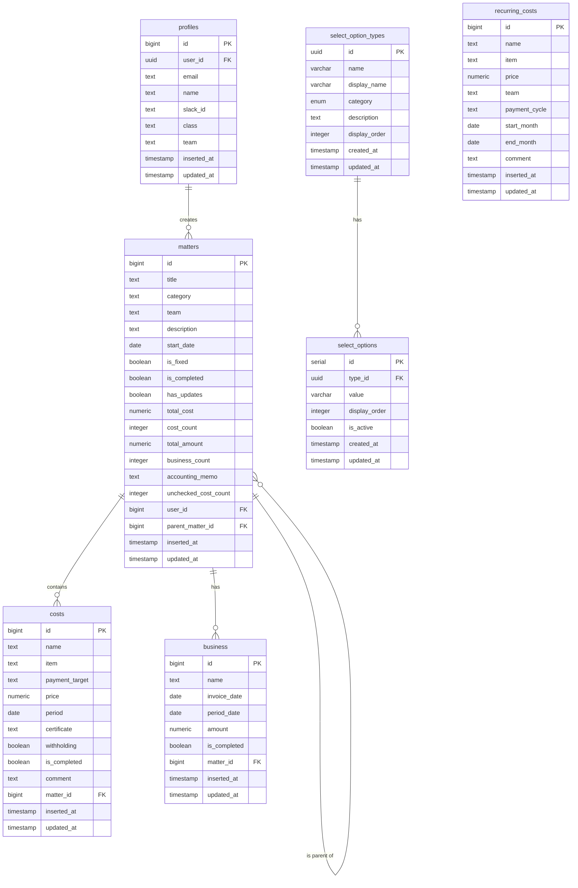

# データベース設計書

## 1. 概要

本設計書は、未来技術推進協会のための案件管理アプリケーションで使用するデータベース設計について記述しています。

### 1.1 使用データベース

- PostgreSQL (Supabase)

### 1.2 スキーマ

- public

## 2. テーブル一覧

| テーブル名          | 説明                                 |
| ------------------- | ------------------------------------ |
| profiles            | ユーザー情報を管理するテーブル       |
| matters             | 案件情報を管理するテーブル           |
| costs               | コスト情報を管理するテーブル         |
| business            | 取引先情報を管理するテーブル         |
| select_option_types | 選択肢の種類を管理するテーブル       |
| select_options      | 選択肢の値を管理するテーブル         |
| recurring_costs     | 定期費用（管理費）を管理するテーブル |

## 3. テーブル詳細

### 3.1 profiles テーブル

ユーザー情報を保持するテーブル

| カラム名    | データ型                 | 制約                                                  | 説明                                           |
| ----------- | ------------------------ | ----------------------------------------------------- | ---------------------------------------------- |
| id          | bigint                   | PRIMARY KEY, GENERATED BY DEFAULT AS IDENTITY         | 主キー                                         |
| user_id     | uuid                     | NOT NULL, UNIQUE, FOREIGN KEY (auth.users)            | Supabase Auth のユーザー ID                    |
| email       | text                     | NOT NULL                                              | メールアドレス                                 |
| name        | text                     | NOT NULL                                              | ユーザー名                                     |
| slack_id    | text                     | NULL                                                  | Slack ID (通知用)                              |
| class       | text                     | DEFAULT 'public'                                      | ユーザー権限 (public/accounting/admin/teamleader) |
| team        | text                     | NULL                                                  | 所属チーム（teamleader権限時に必要）             |
| inserted_at | timestamp with time zone | NOT NULL, DEFAULT timezone('Asia/Tokyo'::text, now()) | 作成日時                                       |
| updated_at  | timestamp with time zone | NOT NULL, DEFAULT timezone('Asia/Tokyo'::text, now()) | 更新日時                                       |

インデックス:

- user_id

### 3.2 matters テーブル

案件情報を保持するテーブル

| カラム名             | データ型                 | 制約                                                  | 説明               |
| -------------------- | ------------------------ | ----------------------------------------------------- | ------------------ |
| id                   | bigint                   | PRIMARY KEY, GENERATED BY DEFAULT AS IDENTITY         | 主キー             |
| title                | text                     | NOT NULL                                              | 案件名             |
| category             | text                     | NOT NULL                                              | 分類               |
| team                 | text                     | NOT NULL                                              | チーム             |
| description          | text                     | NULL                                                  | 説明               |
| start_date           | date                     | NULL                                                  | 案件開始日         |
| is_fixed             | boolean                  | DEFAULT false                                         | 経理申請済みフラグ |
| is_completed         | boolean                  | DEFAULT false                                         | 経理確認完了フラグ |
| has_updates          | boolean                  | DEFAULT false                                         | 申請後更新フラグ   |
| total_cost           | numeric(15,2)            | DEFAULT 0                                             | 合計コスト         |
| cost_count           | integer                  | DEFAULT 0                                             | コスト数           |
| total_amount         | numeric(15,2)            | DEFAULT 0                                             | 合計請求額         |
| business_count       | integer                  | DEFAULT 0                                             | 取引先数           |
| accounting_memo      | text                     | NULL                                                  | 経理メモ           |
| unchecked_cost_count | integer                  | NOT NULL, DEFAULT 0                                   | 未払いコスト数     |
| user_id              | bigint                   | NOT NULL, FOREIGN KEY (profiles.id)                   | ユーザー ID        |
| parent_matter_id     | bigint                   | NULL, FOREIGN KEY (matters.id)                        | 親案件 ID          |
| inserted_at          | timestamp with time zone | NOT NULL, DEFAULT timezone('Asia/Tokyo'::text, now()) | 作成日時           |
| updated_at           | timestamp with time zone | NOT NULL, DEFAULT timezone('Asia/Tokyo'::text, now()) | 更新日時           |

インデックス:

- user_id
- parent_matter_id

### 3.3 costs テーブル

コスト情報を保持するテーブル

| カラム名       | データ型                 | 制約                                                  | 説明             |
| -------------- | ------------------------ | ----------------------------------------------------- | ---------------- |
| id             | bigint                   | PRIMARY KEY, GENERATED ALWAYS AS IDENTITY             | 主キー           |
| name           | text                     | NOT NULL                                              | コスト名         |
| item           | text                     | NOT NULL                                              | 品目             |
| payment_target | text                     | NOT NULL                                              | 支払い先         |
| price          | numeric(15,2)            | NOT NULL                                              | 金額             |
| period         | date                     | NULL                                                  | 支払い期限       |
| certificate    | text                     | NOT NULL                                              | 通知方法         |
| withholding    | boolean                  | NOT NULL, DEFAULT false                               | 源泉徴収フラグ   |
| is_completed   | boolean                  | NOT NULL, DEFAULT false                               | 支払い完了フラグ |
| comment        | text                     | NULL                                                  | コメント         |
| matter_id      | bigint                   | NOT NULL, FOREIGN KEY (matters.id)                    | 案件 ID          |
| inserted_at    | timestamp with time zone | NOT NULL, DEFAULT timezone('Asia/Tokyo'::text, now()) | 作成日時         |
| updated_at     | timestamp with time zone | NOT NULL, DEFAULT timezone('Asia/Tokyo'::text, now()) | 更新日時         |

インデックス:

- matter_id

### 3.4 business テーブル

取引先情報を保持するテーブル

| カラム名     | データ型                 | 制約                                                  | 説明           |
| ------------ | ------------------------ | ----------------------------------------------------- | -------------- |
| id           | bigint                   | PRIMARY KEY, GENERATED ALWAYS AS IDENTITY             | 主キー         |
| name         | text                     | NOT NULL                                              | 取引先名       |
| invoice_date | date                     | NULL                                                  | 請求日         |
| period_date  | date                     | NULL                                                  | 振込期限       |
| amount       | numeric(15,2)            | NULL                                                  | 報酬額         |
| is_completed | boolean                  | NOT NULL, DEFAULT false                               | 確認完了フラグ |
| matter_id    | bigint                   | NOT NULL, FOREIGN KEY (matters.id)                    | 案件 ID        |
| inserted_at  | timestamp with time zone | NOT NULL, DEFAULT timezone('Asia/Tokyo'::text, now()) | 作成日時       |
| updated_at   | timestamp with time zone | NOT NULL, DEFAULT timezone('Asia/Tokyo'::text, now()) | 更新日時       |

インデックス:

- matter_id

### 3.5 select_option_types テーブル

選択肢の種類を管理するテーブル

| カラム名      | データ型                 | 制約                                           | 説明                                    |
| ------------- | ------------------------ | ---------------------------------------------- | --------------------------------------- |
| id            | uuid                     | PRIMARY KEY, DEFAULT gen_random_uuid()         | 主キー                                  |
| name          | varchar                  | NOT NULL, UNIQUE                               | 種類名 (team/category/item/certificate) |
| display_name  | varchar                  | NOT NULL                                       | 表示名                                  |
| category      | information_category     | NOT NULL                                       | カテゴリ (Enum 型)                      |
| description   | text                     | NULL                                           | 説明                                    |
| display_order | integer                  | DEFAULT 0                                      | 表示順                                  |
| created_at    | timestamp with time zone | NOT NULL, DEFAULT timezone('utc'::text, now()) | 作成日時                                |
| updated_at    | timestamp with time zone | NOT NULL, DEFAULT timezone('utc'::text, now()) | 更新日時                                |

### 3.6 select_options テーブル

選択肢の値を管理するテーブル

| カラム名      | データ型                 | 制約                                           | 説明          |
| ------------- | ------------------------ | ---------------------------------------------- | ------------- |
| id            | serial                   | PRIMARY KEY                                    | 主キー        |
| type_id       | uuid                     | FOREIGN KEY (select_option_types.id)           | 選択肢種類 ID |
| value         | varchar                  | NOT NULL                                       | 値            |
| display_order | integer                  | DEFAULT 0                                      | 表示順        |
| is_active     | boolean                  | DEFAULT true                                   | 有効フラグ    |
| created_at    | timestamp with time zone | NOT NULL, DEFAULT timezone('utc'::text, now()) | 作成日時      |
| updated_at    | timestamp with time zone | NOT NULL, DEFAULT timezone('utc'::text, now()) | 更新日時      |

ユニーク制約:

- (type_id, value)

### 3.7 recurring_costs テーブル

定期費用（管理費）を保持するテーブル。定期的にかかる費用を登録し、損益計算書の集計時に支払月（適用開始月を起点に支払サイクル間隔ごと）へ全額算入する（実レコードは月ごとに生成しない）。

| カラム名      | データ型                 | 制約                                                  | 説明                                                   |
| ------------- | ------------------------ | ----------------------------------------------------- | ------------------------------------------------------ |
| id            | bigint                   | PRIMARY KEY, GENERATED ALWAYS AS IDENTITY             | 主キー                                                 |
| name          | text                     | NOT NULL                                              | 名称（例: オフィス家賃）                               |
| item          | text                     | NOT NULL                                              | 品目（select_options の item と同じ値域）              |
| price         | numeric(15,2)            | NOT NULL                                              | 支払額（支払サイクル1回あたり）                        |
| team          | text                     | NULL                                                  | 対象チーム（NULL = 全体共通）                          |
| payment_cycle | text                     | NOT NULL, DEFAULT 'monthly', CHECK (monthly/quarterly/yearly) | 支払サイクル（月払い / 四半期払い / 年払い）  |
| start_month   | date                     | NOT NULL                                              | 適用開始月 = 最初の支払月（月初日で格納: 例 2026-07-01） |
| end_month     | date                     | NULL                                                  | 適用終了月（月初日で格納。NULL = 継続中。当月を含む） |
| comment       | text                     | NULL                                                  | コメント                                               |
| inserted_at   | timestamp with time zone | NOT NULL, DEFAULT timezone('Asia/Tokyo'::text, now()) | 作成日時                                               |
| updated_at    | timestamp with time zone | NOT NULL, DEFAULT timezone('Asia/Tokyo'::text, now()) | 更新日時                                               |

インデックス:

- team
- start_month

## 4. 列挙型

### 4.1 information_category

情報カテゴリの列挙型

| 値            | 説明       |
| ------------- | ---------- |
| basic_info    | 基本情報   |
| business_info | 取引先情報 |
| cost_info     | コスト情報 |

## 5. Row Level Security (RLS)

### 5.1 profiles テーブル

> パフォーマンス最適化のため、`auth.uid()` は `(select auth.uid())` でラップして 1 行ごとの再評価を避けている（Supabase Linter `auth_rls_initplan` 対応）。

```sql
-- 全認証ユーザーが参照可能
CREATE POLICY "Users can view own profile"
  ON profiles
  FOR SELECT
  TO authenticated
  USING (true);

-- 自分自身のプロフィールのみ挿入可能
CREATE POLICY "Users can insert own profile"
  ON profiles
  FOR INSERT
  TO authenticated
  WITH CHECK ((select auth.uid()) = user_id);

-- 自分自身のプロフィールまたは管理者が更新可能
CREATE POLICY "Users can update own profile or admin can update any profile"
  ON profiles
  FOR UPDATE
  TO authenticated
  USING (
    (select auth.uid()) = user_id OR
    EXISTS (
      SELECT 1 FROM profiles p
      WHERE p.user_id = (select auth.uid())
      AND p.class = 'admin'
    )
  );
```

### 5.2 matters テーブル

```sql
-- 自身の案件または経理担当者/管理者/同チームのチームリーダーが参照可能
CREATE POLICY "matters_select_policy" ON matters
    FOR SELECT
    TO authenticated
    USING (
        EXISTS (
            SELECT 1 FROM profiles
            WHERE profiles.id = matters.user_id
            AND profiles.user_id = (select auth.uid())
        ) OR
        EXISTS (
            SELECT 1 FROM profiles
            WHERE profiles.user_id = (select auth.uid())
            AND profiles.class IN ('admin', 'accounting')
        ) OR
        EXISTS (
            SELECT 1 FROM profiles
            WHERE profiles.user_id = (select auth.uid())
            AND profiles.class = 'teamleader'
            AND profiles.team IS NOT NULL
            AND profiles.team = matters.team
        )
    );

-- 自身の案件のみ挿入可能
CREATE POLICY "matters_insert_policy" ON matters
    FOR INSERT
    TO authenticated
    WITH CHECK (
        EXISTS (
            SELECT 1 FROM profiles
            WHERE profiles.id = matters.user_id
            AND profiles.user_id = (select auth.uid())
        )
    );

-- 自身の案件または経理担当者/管理者が更新可能
-- 経理申請済の案件も編集可能にする（has_updatesフラグを設定）
CREATE POLICY "matters_update_policy" ON matters
    FOR UPDATE
    TO authenticated
    USING (
        EXISTS (
            SELECT 1 FROM profiles
            WHERE profiles.id = matters.user_id
            AND profiles.user_id = (select auth.uid())
        ) OR
        EXISTS (
            SELECT 1 FROM profiles
            WHERE profiles.user_id = (select auth.uid())
            AND profiles.class IN ('admin', 'accounting')
        )
    );

-- 自身の案件または管理者が削除可能
CREATE POLICY "matters_delete_policy" ON matters
    FOR DELETE
    TO authenticated
    USING (
        EXISTS (
            SELECT 1 FROM profiles
            WHERE profiles.id = matters.user_id
            AND profiles.user_id = (select auth.uid())
        ) OR
        EXISTS (
            SELECT 1 FROM profiles
            WHERE profiles.user_id = (select auth.uid())
            AND profiles.class = 'admin'
        )
    );
```

### 5.3 costs テーブル

```sql
-- 自身の案件に関連するコスト、同チームのチームリーダー、または経理担当者/管理者が参照可能
CREATE POLICY "costs_select_policy" ON costs
    FOR SELECT
    TO authenticated
    USING (
        EXISTS (
            SELECT 1 FROM matters
            JOIN profiles ON profiles.id = matters.user_id
            WHERE matters.id = costs.matter_id
            AND profiles.user_id = (select auth.uid())
        ) OR
        EXISTS (
            SELECT 1 FROM profiles
            WHERE profiles.user_id = (select auth.uid())
            AND profiles.class IN ('admin', 'accounting')
        ) OR
        EXISTS (
            SELECT 1 FROM profiles cu, matters
            WHERE matters.id = costs.matter_id
            AND cu.user_id = (select auth.uid())
            AND cu.class = 'teamleader'
            AND cu.team IS NOT NULL
            AND cu.team = matters.team
        )
    );

-- 自身の案件に関連するコストのみ挿入可能
CREATE POLICY "costs_insert_policy" ON costs
    FOR INSERT
    TO authenticated
    WITH CHECK (
        EXISTS (
            SELECT 1 FROM matters
            JOIN profiles ON profiles.id = matters.user_id
            WHERE matters.id = costs.matter_id
            AND profiles.user_id = (select auth.uid())
        )
    );

-- 自身の案件に関連するコストまたは経理担当者/管理者が更新可能
CREATE POLICY "costs_update_policy" ON costs
    FOR UPDATE
    TO authenticated
    USING (
        EXISTS (
            SELECT 1 FROM matters
            JOIN profiles ON profiles.id = matters.user_id
            WHERE matters.id = costs.matter_id
            AND profiles.user_id = (select auth.uid())
        ) OR
        EXISTS (
            SELECT 1 FROM profiles
            WHERE profiles.user_id = (select auth.uid())
            AND profiles.class IN ('admin', 'accounting')
        )
    );

-- 自身の案件に関連するコストまたは管理者が削除可能
CREATE POLICY "costs_delete_policy" ON costs
    FOR DELETE
    TO authenticated
    USING (
        EXISTS (
            SELECT 1 FROM matters
            JOIN profiles ON profiles.id = matters.user_id
            WHERE matters.id = costs.matter_id
            AND profiles.user_id = (select auth.uid())
        ) OR
        EXISTS (
            SELECT 1 FROM profiles
            WHERE profiles.user_id = (select auth.uid())
            AND profiles.class = 'admin'
        )
    );
```

### 5.4 business テーブル

```sql
-- 自身の案件に関連する取引先、同チームのチームリーダー、または経理担当者/管理者が参照可能
CREATE POLICY "business_select_policy" ON business
    FOR SELECT
    TO authenticated
    USING (
        EXISTS (
            SELECT 1 FROM matters
            JOIN profiles ON profiles.id = matters.user_id
            WHERE matters.id = business.matter_id
            AND profiles.user_id = (select auth.uid())
        ) OR
        EXISTS (
            SELECT 1 FROM profiles
            WHERE profiles.user_id = (select auth.uid())
            AND profiles.class IN ('admin', 'accounting')
        ) OR
        EXISTS (
            SELECT 1 FROM profiles cu, matters
            WHERE matters.id = business.matter_id
            AND cu.user_id = (select auth.uid())
            AND cu.class = 'teamleader'
            AND cu.team IS NOT NULL
            AND cu.team = matters.team
        )
    );

-- 自身の案件に関連する取引先のみ挿入可能
CREATE POLICY "business_insert_policy" ON business
    FOR INSERT
    TO authenticated
    WITH CHECK (
        EXISTS (
            SELECT 1 FROM matters
            JOIN profiles ON profiles.id = matters.user_id
            WHERE matters.id = business.matter_id
            AND profiles.user_id = (select auth.uid())
        )
    );

-- 自身の案件に関連する取引先または経理担当者/管理者が更新可能
CREATE POLICY "business_update_policy" ON business
    FOR UPDATE
    TO authenticated
    USING (
        EXISTS (
            SELECT 1 FROM matters
            JOIN profiles ON profiles.id = matters.user_id
            WHERE matters.id = business.matter_id
            AND profiles.user_id = (select auth.uid())
        ) OR
        EXISTS (
            SELECT 1 FROM profiles
            WHERE profiles.user_id = (select auth.uid())
            AND profiles.class IN ('admin', 'accounting')
        )
    );

-- 自身の案件に関連する取引先または管理者が削除可能
CREATE POLICY "business_delete_policy" ON business
    FOR DELETE
    TO authenticated
    USING (
        EXISTS (
            SELECT 1 FROM matters
            JOIN profiles ON profiles.id = matters.user_id
            WHERE matters.id = business.matter_id
            AND profiles.user_id = (select auth.uid())
        ) OR
        EXISTS (
            SELECT 1 FROM profiles
            WHERE profiles.user_id = (select auth.uid())
            AND profiles.class = 'admin'
        )
    );
```

### 5.5 select_option_types テーブル・select_options テーブル

> 管理者向け書き込みポリシーは `FOR ALL` ではなく `INSERT/UPDATE/DELETE` を個別に定義する。`FOR ALL` だと SELECT も対象となり、参照用ポリシーと重複して Supabase Linter `multiple_permissive_policies` が発火するため。

```sql
-- 全認証ユーザーが参照可能
CREATE POLICY "Users can view select option types" ON select_option_types
    FOR SELECT USING (true);

CREATE POLICY "Users can view select options" ON select_options
    FOR SELECT USING (true);

-- 管理者のみ書き込み可能（select_option_types）
CREATE POLICY "Admin can insert select option types" ON select_option_types
    FOR INSERT TO authenticated
    WITH CHECK (
        EXISTS (
            SELECT 1 FROM profiles
            WHERE profiles.user_id = (select auth.uid())
            AND profiles.class = 'admin'
        )
    );

CREATE POLICY "Admin can update select option types" ON select_option_types
    FOR UPDATE TO authenticated
    USING (
        EXISTS (
            SELECT 1 FROM profiles
            WHERE profiles.user_id = (select auth.uid())
            AND profiles.class = 'admin'
        )
    );

CREATE POLICY "Admin can delete select option types" ON select_option_types
    FOR DELETE TO authenticated
    USING (
        EXISTS (
            SELECT 1 FROM profiles
            WHERE profiles.user_id = (select auth.uid())
            AND profiles.class = 'admin'
        )
    );

-- 管理者のみ書き込み可能（select_options）
CREATE POLICY "Admin can insert select options" ON select_options
    FOR INSERT TO authenticated
    WITH CHECK (
        EXISTS (
            SELECT 1 FROM profiles
            WHERE profiles.user_id = (select auth.uid())
            AND profiles.class = 'admin'
        )
    );

CREATE POLICY "Admin can update select options" ON select_options
    FOR UPDATE TO authenticated
    USING (
        EXISTS (
            SELECT 1 FROM profiles
            WHERE profiles.user_id = (select auth.uid())
            AND profiles.class = 'admin'
        )
    );

CREATE POLICY "Admin can delete select options" ON select_options
    FOR DELETE TO authenticated
    USING (
        EXISTS (
            SELECT 1 FROM profiles
            WHERE profiles.user_id = (select auth.uid())
            AND profiles.class = 'admin'
        )
    );
```

### 5.6 recurring_costs テーブル

> teamleader が全体共通（team IS NULL）の行を SELECT できるのは、損益計算書で「全体共通（参考）」として表示するため。チーム損益への算入可否はアプリケーション層で制御する。

```sql
-- 経理担当者/管理者は全行、チームリーダーは自チームの行 + 全体共通の行を参照可能
CREATE POLICY "recurring_costs_select_policy" ON recurring_costs
    FOR SELECT TO authenticated
    USING (
        EXISTS (
            SELECT 1 FROM profiles
            WHERE profiles.user_id = (select auth.uid())
            AND profiles.class IN ('admin', 'accounting')
        ) OR
        EXISTS (
            SELECT 1 FROM profiles
            WHERE profiles.user_id = (select auth.uid())
            AND profiles.class = 'teamleader'
            AND profiles.team IS NOT NULL
            AND (recurring_costs.team IS NULL OR recurring_costs.team = profiles.team)
        )
    );

-- 経理担当者/管理者のみ挿入可能
CREATE POLICY "recurring_costs_insert_policy" ON recurring_costs
    FOR INSERT TO authenticated
    WITH CHECK (
        EXISTS (
            SELECT 1 FROM profiles
            WHERE profiles.user_id = (select auth.uid())
            AND profiles.class IN ('admin', 'accounting')
        )
    );

-- 経理担当者/管理者のみ更新可能
CREATE POLICY "recurring_costs_update_policy" ON recurring_costs
    FOR UPDATE TO authenticated
    USING (
        EXISTS (
            SELECT 1 FROM profiles
            WHERE profiles.user_id = (select auth.uid())
            AND profiles.class IN ('admin', 'accounting')
        )
    );

-- 経理担当者/管理者のみ削除可能
CREATE POLICY "recurring_costs_delete_policy" ON recurring_costs
    FOR DELETE TO authenticated
    USING (
        EXISTS (
            SELECT 1 FROM profiles
            WHERE profiles.user_id = (select auth.uid())
            AND profiles.class IN ('admin', 'accounting')
        )
    );
```

## 6. トリガー

### 6.1 updated_at 更新トリガー

全テーブルに対して、更新時に updated_at カラムを現在時刻で更新するトリガーを設定。

```sql
-- 更新時のタイムスタンプ更新関数
CREATE OR REPLACE FUNCTION update_updated_at_column()
RETURNS TRIGGER AS $
BEGIN
    NEW.updated_at = timezone('Asia/Tokyo'::text, now());
    RETURN NEW;
END;
$ LANGUAGE plpgsql;

-- テーブルごとのトリガー設定
CREATE TRIGGER update_profiles_updated_at
    BEFORE UPDATE ON profiles
    FOR EACH ROW
    EXECUTE PROCEDURE update_updated_at_column();

CREATE TRIGGER update_matters_updated_at
    BEFORE UPDATE ON matters
    FOR EACH ROW
    EXECUTE PROCEDURE update_updated_at_column();

CREATE TRIGGER update_costs_updated_at
    BEFORE UPDATE ON costs
    FOR EACH ROW
    EXECUTE PROCEDURE update_updated_at_column();

CREATE TRIGGER update_business_updated_at
    BEFORE UPDATE ON business
    FOR EACH ROW
    EXECUTE PROCEDURE update_updated_at_column();

CREATE TRIGGER update_recurring_costs_updated_at
    BEFORE UPDATE ON recurring_costs
    FOR EACH ROW
    EXECUTE PROCEDURE update_updated_at_column();
```

### 6.2 案件更新検知トリガー

経理申請済み案件が更新された場合に、has_updates フラグを true に設定するトリガー

```sql
-- 案件更新検知関数
CREATE OR REPLACE FUNCTION detect_matter_updates()
RETURNS TRIGGER AS $
BEGIN
    -- 経理申請済みで、かつ経理確認未完了の案件が更新された場合
    IF OLD.is_fixed = TRUE AND NEW.is_fixed = TRUE AND NEW.is_completed = FALSE THEN
        -- 更新フラグをONにする
        NEW.has_updates = TRUE;
    END IF;
    RETURN NEW;
END;
$ LANGUAGE plpgsql;

-- トリガー設定
CREATE TRIGGER detect_matters_updates
    BEFORE UPDATE ON matters
    FOR EACH ROW
    EXECUTE PROCEDURE detect_matter_updates();
```

### 6.3 売上金額チェックトリガー

経理申請時に売上金額が 0 の場合に警告を表示するトリガー（アプリケーション側で実装）

```sql
-- この機能はアプリケーション側で実装
-- データベース側ではトリガーではなく、アプリケーションロジックで対応
```

## 7. ER 図



## 8. 初期データ

### 8.1 選択肢マスタ

```sql
-- 選択肢の種類
INSERT INTO select_option_types (name, display_name, category, display_order) VALUES
    ('team', 'チーム', 'basic_info', 1),
    ('category', '分類', 'basic_info', 2),
    ('item', '品目', 'cost_info', 1),
    ('certificate', '通知方法', 'cost_info', 2);

-- チーム選択肢
INSERT INTO select_options (type_id, value, display_order) VALUES
    ((SELECT id FROM select_option_types WHERE name = 'team'), 'シンラボ', 1),
    ((SELECT id FROM select_option_types WHERE name = 'team'), 'SDGs', 2),
    ((SELECT id FROM select_option_types WHERE name = 'team'), '広報', 3),
    ((SELECT id FROM select_option_types WHERE name = 'team'), 'AI事業創出', 4),
    ((SELECT id FROM select_option_types WHERE name = 'team'), 'ハロスク', 5),
    ((SELECT id FROM select_option_types WHERE name = 'team'), '事務局', 6);

-- 案件分類選択肢
INSERT INTO select_options (type_id, value, display_order) VALUES
    ((SELECT id FROM select_option_types WHERE name = 'category'), '会員費', 1),
    ((SELECT id FROM select_option_types WHERE name = 'category'), '受託案件', 2),
    ((SELECT id FROM select_option_types WHERE name = 'category'), '認定ファシリ', 3),
    ((SELECT id FROM select_option_types WHERE name = 'category'), '研修・検定', 4),
    ((SELECT id FROM select_option_types WHERE name = 'category'), 'ボードゲーム', 5),
    ((SELECT id FROM select_option_types WHERE name = 'category'), 'イベント', 6),
    ((SELECT id FROM select_option_types WHERE name = 'category'), 'ハロスク', 7),
    ((SELECT id FROM select_option_types WHERE name = 'category'), 'その他', 8);

-- 費目選択肢
INSERT INTO select_options (type_id, value, display_order) VALUES
    ((SELECT id FROM select_option_types WHERE name = 'item'), 'システム料', 1),
    ((SELECT id FROM select_option_types WHERE name = 'item'), '施設利用料', 2),
    ((SELECT id FROM select_option_types WHERE name = 'item'), '外注費', 3),
    ((SELECT id FROM select_option_types WHERE name = 'item'), '備品購入', 4),
    ((SELECT id FROM select_option_types WHERE name = 'item'), 'メンバー報酬', 5),
    ((SELECT id FROM select_option_types WHERE name = 'item'), 'シンラボ活動費', 6),
    ((SELECT id FROM select_option_types WHERE name = 'item'), '広告宣伝費', 7),
    ((SELECT id FROM select_option_types WHERE name = 'item'), '教育・研修', 8),
    ((SELECT id FROM select_option_types WHERE name = 'item'), '営業費', 9),
    ((SELECT id FROM select_option_types WHERE name = 'item'), 'その他', 10);

-- 証憑選択肢
INSERT INTO select_options (type_id, value, display_order) VALUES
    ((SELECT id FROM select_option_types WHERE name = 'certificate'), '請求書', 1),
    ((SELECT id FROM select_option_types WHERE name = 'certificate'), '領収書', 2);
```
