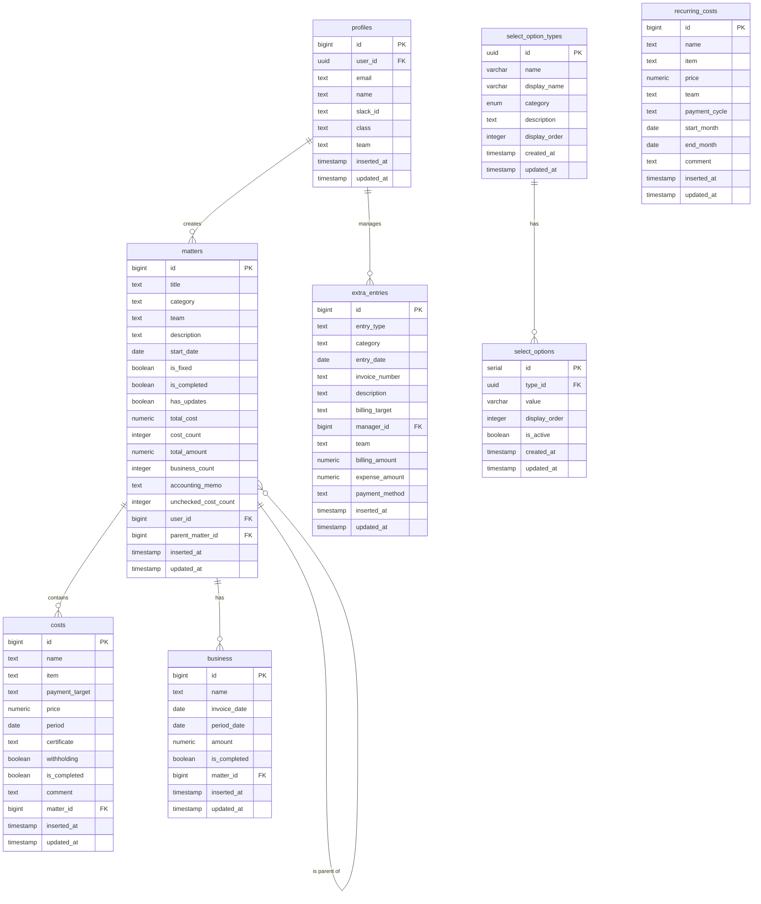

# データベース設計書

## 1. 概要

本設計書は、未来技術推進協会のための経理システムで使用するデータベース設計について記述しています。

### 1.1 使用データベース

- PostgreSQL (Supabase)

### 1.2 スキーマ

- public

### 1.3 タイムゾーン方針

- **セッションタイムゾーンは UTC**（PostgreSQL / Supabase の既定）。`supabase/migrations/` は `ALTER DATABASE ... SET timezone` を含まない。旧ローカル手適用 SQL にあった当該設定は、正であるマイグレーション経路では一度も適用されていなかった。hosted Supabase では `ALTER DATABASE` が失敗しうるため、Phase 0 でも追加しない。
- **案件系の `inserted_at` / `updated_at` は `timezone('Asia/Tokyo'::text, now())`**（カラム DEFAULT と `update_updated_at_column` トリガー）。`timezone(zone, timestamptz)` の戻りは **TZ なし `timestamp`**（そのゾーンの壁時計）である。これを `timestamptz` 列へ入れると **セッション `TimeZone` のローカル時刻として解釈**される。セッションが UTC のとき、保存される絶対時刻は「今」から約 9 時間ずれる。セッションが `Asia/Tokyo` ならずれない。つまり現行 DEFAULT / トリガーの保存値はセッション TZ に依存する。
- **絶対時刻をセッション非依存で残す**なら DEFAULT / トリガーは `now()`（`timestamptz`）である。実装変更は後続フェーズで検討する。
- **アドホック SQL で日付境界を切る場合**はセッション TZ に頼らず、`timezone('Asia/Tokyo', ...)` または `AT TIME ZONE 'Asia/Tokyo'` を明示すること。`now()::date` や素の `date_trunc` は UTC 日付になり、JST 0:00〜9:00 で日付がずれる。
- **Vitest** は `vitest.config.ts` で `TZ=Asia/Tokyo` を固定する。Next.js アプリのプロセス TZ は実行環境依存であり、日付表示は `app/utils/formatter.ts` などが `new Date()` のローカル TZ に従う。

## 2. テーブル一覧

| テーブル名          | 説明                                                         |
| ------------------- | ------------------------------------------------------------ |
| profiles            | ユーザー情報を管理するテーブル                               |
| matters             | 案件情報を管理するテーブル                                   |
| costs               | コスト情報を管理するテーブル                                 |
| business            | 取引先情報を管理するテーブル                                 |
| select_option_types | 選択肢の種類を管理するテーブル                               |
| select_options      | 選択肢の値を管理するテーブル                                 |
| recurring_costs     | 定期費用（管理費）を管理するテーブル                         |
| extra_entries       | 経理追加収支（案件に紐づかない収入・支出）を管理するテーブル |

## 3. テーブル詳細

### 3.1 profiles テーブル

ユーザー情報を保持するテーブル

| カラム名    | データ型                 | 制約                                                  | 説明                                              |
| ----------- | ------------------------ | ----------------------------------------------------- | ------------------------------------------------- |
| id          | bigint                   | PRIMARY KEY, GENERATED BY DEFAULT AS IDENTITY         | 主キー                                            |
| user_id     | uuid                     | NOT NULL, UNIQUE, FOREIGN KEY (auth.users)            | Supabase Auth のユーザー ID                       |
| email       | text                     | NOT NULL                                              | メールアドレス                                    |
| name        | text                     | NOT NULL                                              | ユーザー名                                        |
| slack_id    | text                     | NULL                                                  | Slack ID (通知用)                                 |
| class       | text                     | DEFAULT 'public'                                      | ユーザー権限 (public/accounting/admin/teamleader) |
| team        | text                     | NULL                                                  | 所属チーム（teamleader権限時に必要）              |
| inserted_at | timestamp with time zone | NOT NULL, DEFAULT timezone('Asia/Tokyo'::text, now()) | 作成日時                                          |
| updated_at  | timestamp with time zone | NOT NULL, DEFAULT timezone('Asia/Tokyo'::text, now()) | 更新日時                                          |

インデックス:

- user_id

### 3.2 matters テーブル

案件情報を保持するテーブル

| カラム名             | データ型                 | 制約                                                  | 説明               |
| -------------------- | ------------------------ | ----------------------------------------------------- | ------------------ |
| id                   | bigint                   | PRIMARY KEY, GENERATED BY DEFAULT AS IDENTITY         | 主キー             |
| title                | text                     | NOT NULL                                              | 案件名             |
| category             | text                     | NOT NULL                                              | 分類               |
| team                 | text                     | NOT NULL                                              | チーム             |
| description          | text                     | NULL                                                  | 説明               |
| start_date           | date                     | NULL                                                  | 案件開始日         |
| is_fixed             | boolean                  | DEFAULT false                                         | 経理申請済みフラグ |
| is_completed         | boolean                  | DEFAULT false                                         | 経理確認完了フラグ |
| has_updates          | boolean                  | DEFAULT false                                         | 申請後更新フラグ   |
| total_cost           | numeric(15,2)            | DEFAULT 0                                             | 合計コスト         |
| cost_count           | integer                  | DEFAULT 0                                             | コスト数           |
| total_amount         | numeric(15,2)            | DEFAULT 0                                             | 合計請求額         |
| business_count       | integer                  | DEFAULT 0                                             | 取引先数           |
| accounting_memo      | text                     | NULL                                                  | 経理メモ           |
| unchecked_cost_count | integer                  | NOT NULL, DEFAULT 0                                   | 未払いコスト数     |
| user_id              | bigint                   | NOT NULL, FOREIGN KEY (profiles.id)                   | ユーザー ID        |
| parent_matter_id     | bigint                   | NULL, FOREIGN KEY (matters.id)                        | 親案件 ID          |
| inserted_at          | timestamp with time zone | NOT NULL, DEFAULT timezone('Asia/Tokyo'::text, now()) | 作成日時           |
| updated_at           | timestamp with time zone | NOT NULL, DEFAULT timezone('Asia/Tokyo'::text, now()) | 更新日時           |

インデックス:

- user_id
- parent_matter_id

### 3.3 costs テーブル

コスト情報を保持するテーブル

| カラム名       | データ型                 | 制約                                                  | 説明             |
| -------------- | ------------------------ | ----------------------------------------------------- | ---------------- |
| id             | bigint                   | PRIMARY KEY, GENERATED ALWAYS AS IDENTITY             | 主キー           |
| name           | text                     | NOT NULL                                              | コスト名         |
| item           | text                     | NOT NULL                                              | 品目             |
| payment_target | text                     | NOT NULL                                              | 支払い先         |
| price          | numeric(15,2)            | NOT NULL                                              | 金額             |
| period         | date                     | NULL                                                  | 支払い期限       |
| certificate    | text                     | NOT NULL                                              | 通知方法         |
| withholding    | boolean                  | NOT NULL, DEFAULT false                               | 源泉徴収フラグ   |
| is_completed   | boolean                  | NOT NULL, DEFAULT false                               | 支払い完了フラグ |
| comment        | text                     | NULL                                                  | コメント         |
| matter_id      | bigint                   | NOT NULL, FOREIGN KEY (matters.id)                    | 案件 ID          |
| inserted_at    | timestamp with time zone | NOT NULL, DEFAULT timezone('Asia/Tokyo'::text, now()) | 作成日時         |
| updated_at     | timestamp with time zone | NOT NULL, DEFAULT timezone('Asia/Tokyo'::text, now()) | 更新日時         |

インデックス:

- matter_id

### 3.4 business テーブル

取引先情報を保持するテーブル

| カラム名     | データ型                 | 制約                                                  | 説明           |
| ------------ | ------------------------ | ----------------------------------------------------- | -------------- |
| id           | bigint                   | PRIMARY KEY, GENERATED ALWAYS AS IDENTITY             | 主キー         |
| name         | text                     | NOT NULL                                              | 取引先名       |
| invoice_date | date                     | NULL                                                  | 請求日         |
| period_date  | date                     | NULL                                                  | 振込期限       |
| amount       | numeric(15,2)            | NULL                                                  | 報酬額         |
| is_completed | boolean                  | NOT NULL, DEFAULT false                               | 確認完了フラグ |
| matter_id    | bigint                   | NOT NULL, FOREIGN KEY (matters.id)                    | 案件 ID        |
| inserted_at  | timestamp with time zone | NOT NULL, DEFAULT timezone('Asia/Tokyo'::text, now()) | 作成日時       |
| updated_at   | timestamp with time zone | NOT NULL, DEFAULT timezone('Asia/Tokyo'::text, now()) | 更新日時       |

インデックス:

- matter_id

### 3.5 select_option_types テーブル

選択肢の種類を管理するテーブル

| カラム名      | データ型                 | 制約                                           | 説明                                    |
| ------------- | ------------------------ | ---------------------------------------------- | --------------------------------------- |
| id            | uuid                     | PRIMARY KEY, DEFAULT gen_random_uuid()         | 主キー                                  |
| name          | varchar                  | NOT NULL, UNIQUE                               | 種類名 (team/category/item/certificate) |
| display_name  | varchar                  | NOT NULL                                       | 表示名                                  |
| category      | information_category     | NOT NULL                                       | カテゴリ (Enum 型)                      |
| description   | text                     | NULL                                           | 説明                                    |
| display_order | integer                  | DEFAULT 0                                      | 表示順                                  |
| created_at    | timestamp with time zone | NOT NULL, DEFAULT timezone('utc'::text, now()) | 作成日時                                |
| updated_at    | timestamp with time zone | NOT NULL, DEFAULT timezone('utc'::text, now()) | 更新日時                                |

### 3.6 select_options テーブル

選択肢の値を管理するテーブル

| カラム名      | データ型                 | 制約                                           | 説明          |
| ------------- | ------------------------ | ---------------------------------------------- | ------------- |
| id            | serial                   | PRIMARY KEY                                    | 主キー        |
| type_id       | uuid                     | FOREIGN KEY (select_option_types.id)           | 選択肢種類 ID |
| value         | varchar                  | NOT NULL                                       | 値            |
| display_order | integer                  | DEFAULT 0                                      | 表示順        |
| is_active     | boolean                  | DEFAULT true                                   | 有効フラグ    |
| created_at    | timestamp with time zone | NOT NULL, DEFAULT timezone('utc'::text, now()) | 作成日時      |
| updated_at    | timestamp with time zone | NOT NULL, DEFAULT timezone('utc'::text, now()) | 更新日時      |

ユニーク制約:

- (type_id, value)

### 3.7 recurring_costs テーブル

定期費用（管理費）を保持するテーブル。定期的にかかる費用を登録し、損益計算書の集計時に支払月（適用開始月を起点に支払サイクル間隔ごと）へ全額算入する（実レコードは月ごとに生成しない）。

| カラム名      | データ型                 | 制約                                                          | 説明                                                     |
| ------------- | ------------------------ | ------------------------------------------------------------- | -------------------------------------------------------- |
| id            | bigint                   | PRIMARY KEY, GENERATED ALWAYS AS IDENTITY                     | 主キー                                                   |
| name          | text                     | NOT NULL                                                      | 名称（例: オフィス家賃）                                 |
| item          | text                     | NOT NULL                                                      | 品目（select_options の item と同じ値域）                |
| price         | numeric(15,2)            | NOT NULL                                                      | 支払額（支払サイクル1回あたり）                          |
| team          | text                     | NULL                                                          | 対象チーム（NULL = 全体共通）                            |
| payment_cycle | text                     | NOT NULL, DEFAULT 'monthly', CHECK (monthly/quarterly/yearly) | 支払サイクル（月払い / 四半期払い / 年払い）             |
| start_month   | date                     | NOT NULL                                                      | 適用開始月 = 最初の支払月（月初日で格納: 例 2026-07-01） |
| end_month     | date                     | NULL                                                          | 適用終了月（月初日で格納。NULL = 継続中。当月を含む）    |
| comment       | text                     | NULL                                                          | コメント                                                 |
| inserted_at   | timestamp with time zone | NOT NULL, DEFAULT timezone('Asia/Tokyo'::text, now())         | 作成日時                                                 |
| updated_at    | timestamp with time zone | NOT NULL, DEFAULT timezone('Asia/Tokyo'::text, now())         | 更新日時                                                 |

インデックス:

- team
- start_month

### 3.8 extra_entries テーブル

経理追加収支（案件に紐づかない収入・支出）を保持するテーブル。損益計算書の集計時に entry_date（日付）の属する月へ算入する（収入の請求額 → 売上合計、経費 → 案件費用合計。日付未入力は月未確定）。金額はマイナスを許容し、損益計算書上での減額調整に使う。

| カラム名       | データ型                 | 制約                                                  | 説明                                                                                 |
| -------------- | ------------------------ | ----------------------------------------------------- | ------------------------------------------------------------------------------------ |
| id             | bigint                   | PRIMARY KEY, GENERATED ALWAYS AS IDENTITY             | 主キー                                                                               |
| entry_type     | text                     | NOT NULL, CHECK (entry_type IN ('income', 'expense')) | 種別（income = 収入 / expense = 支出）                                               |
| category       | text                     | NOT NULL                                              | 分類（収入時は extra_income_category、支出時は extra_expense_category マスタの値域） |
| entry_date     | date                     | NULL                                                  | 日付（損益計算書の計上月の判定に使用。NULL = 月未確定）                              |
| invoice_number | text                     | NULL                                                  | 請求書番号（収入時のみ）                                                             |
| description    | text                     | NOT NULL                                              | 内容                                                                                 |
| billing_target | text                     | NULL                                                  | 請求先（収入時のみ）                                                                 |
| manager_id     | bigint                   | NOT NULL, FOREIGN KEY (profiles.id)                   | 責任者（メンバー）                                                                   |
| team           | text                     | NULL                                                  | 対象チーム（NULL = 全体共通）                                                        |
| billing_amount | numeric(15,2)            | NULL, CHECK (billing_amount <> 0)                     | 請求額（円・税別。マイナス可・0 不可。収入時のみ）                                   |
| expense_amount | numeric(15,2)            | NULL, CHECK (expense_amount <> 0)                     | 経費（円・税別。マイナス可・0 不可。収入時は任意、支出時は必須）                     |
| payment_method | text                     | NULL                                                  | 決済方法（payment_method マスタの値域。支出時のみ）                                  |
| inserted_at    | timestamp with time zone | NOT NULL, DEFAULT timezone('Asia/Tokyo'::text, now()) | 作成日時                                                                             |
| updated_at     | timestamp with time zone | NOT NULL, DEFAULT timezone('Asia/Tokyo'::text, now()) | 更新日時                                                                             |

CHECK 制約（種別ごとの項目の整合性）:

```sql
-- 収入: 請求額必須・決済方法なし / 支出: 経費・決済方法必須、収入専用項目（請求書番号・請求先・請求額）なし
CHECK (
    (entry_type = 'income' AND billing_amount IS NOT NULL AND payment_method IS NULL) OR
    (entry_type = 'expense' AND expense_amount IS NOT NULL AND payment_method IS NOT NULL
        AND billing_amount IS NULL AND invoice_number IS NULL AND billing_target IS NULL)
)
```

インデックス:

- team
- entry_date
- manager_id

## 4. 列挙型

### 4.1 information_category

情報カテゴリの列挙型

| 値            | 説明       |
| ------------- | ---------- |
| basic_info    | 基本情報   |
| business_info | 取引先情報 |
| cost_info     | コスト情報 |

## 5. Row Level Security (RLS)

### 5.0 テーブル / シーケンス権限（PostgREST の前提）

RLS は行スコープのゲートであり、テーブルに対する `GRANT SELECT / INSERT / UPDATE / DELETE` が無いと PostgREST は RLS を評価する前に HTTP 403 を返す。

現行のローカル Supabase Postgres イメージは `public` スキーマの DEFAULT PRIVILEGES が厳格化されており、マイグレーションの `CREATE TABLE` だけでは `anon` / `authenticated` / `service_role` に CRUD が付かない（付くのは `TRUNCATE` / `REFERENCES` / `TRIGGER` / `MAINTAIN` のみ）。`supabase/migrations/20260826000000_17_grant_public_crud.sql` で標準的なテーブル / シーケンス GRANT と DEFAULT PRIVILEGES を明示する。関数の `EXECUTE` は付与しない（migration 15/16 の `custom_access_token_hook` 制限を維持する）。

`supabase db reset` はこのマイグレーションを含めて再適用するため、リセット後も PostgREST が 403 に戻らない。

### 5.1 profiles テーブル

> パフォーマンス最適化のため、`auth.uid()` は `(select auth.uid())` でラップして 1 行ごとの再評価を避けている（Supabase Linter `auth_rls_initplan` 対応）。

> SELECT は「自分 / 経理・管理者 / 同チームのチームリーダー」に限定している（旧 `USING (true)` では全ログインユーザーが他人の email・class 等を読めたため）。閲覧者自身の `class` / `team` を SELECT ポリシー内で参照すると profiles への再帰参照で無限再帰になるため、`SECURITY DEFINER` のヘルパ関数（`auth_user_class()` / `auth_user_team()`、RLS をバイパスして自分の 1 行のみ読む）経由で取得する。

```sql
-- 閲覧者自身の class / team を RLS バイパスで取得するヘルパ（再帰回避用）
CREATE OR REPLACE FUNCTION public.auth_user_class()
RETURNS text LANGUAGE sql SECURITY DEFINER STABLE SET search_path = ''
AS $$ SELECT class FROM public.profiles WHERE user_id = (select auth.uid()) LIMIT 1 $$;

CREATE OR REPLACE FUNCTION public.auth_user_team()
RETURNS text LANGUAGE sql SECURITY DEFINER STABLE SET search_path = ''
AS $$ SELECT team FROM public.profiles WHERE user_id = (select auth.uid()) LIMIT 1 $$;

-- ヘルパ関数は認証済みロールのみ実行可能（不特定多数からの直接呼び出しを防ぐ）
REVOKE EXECUTE ON FUNCTION public.auth_user_class() FROM PUBLIC;
REVOKE EXECUTE ON FUNCTION public.auth_user_team() FROM PUBLIC;
GRANT EXECUTE ON FUNCTION public.auth_user_class() TO authenticated;
GRANT EXECUTE ON FUNCTION public.auth_user_team() TO authenticated;

-- 自分 / 経理・管理者 / 同チームのチームリーダーのみ参照可能
CREATE POLICY "Users can view own profile"
  ON profiles
  FOR SELECT
  TO authenticated
  USING (
    user_id = (select auth.uid())
    OR public.auth_user_class() IN ('admin', 'accounting')
    OR (
      public.auth_user_class() = 'teamleader'
      AND public.auth_user_team() IS NOT NULL
      AND profiles.team = public.auth_user_team()
    )
  );

-- 自分自身のプロフィールのみ挿入可能
CREATE POLICY "Users can insert own profile"
  ON profiles
  FOR INSERT
  TO authenticated
  WITH CHECK ((select auth.uid()) = user_id);

-- 自分自身のプロフィールまたは管理者が更新可能。
-- WITH CHECK で更新後の値も制約し、admin 以外による class/team/user_id の改変
-- （自己昇格・所有者付け替え）を防ぐ。
CREATE POLICY "Users can update own profile or admin can update any profile"
  ON profiles
  FOR UPDATE
  TO authenticated
  USING (
    user_id = (select auth.uid())
    OR public.auth_user_class() = 'admin'
  )
  WITH CHECK (
    public.auth_user_class() = 'admin'
    OR (
      user_id = (select auth.uid())
      AND class IS NOT DISTINCT FROM public.auth_user_class()
      AND team  IS NOT DISTINCT FROM public.auth_user_team()
    )
  );
```

### 5.2 matters テーブル

```sql
-- 自身の案件または経理担当者/管理者/同チームのチームリーダーが参照可能
CREATE POLICY "matters_select_policy" ON matters
    FOR SELECT
    TO authenticated
    USING (
        EXISTS (
            SELECT 1 FROM profiles
            WHERE profiles.id = matters.user_id
            AND profiles.user_id = (select auth.uid())
        ) OR
        EXISTS (
            SELECT 1 FROM profiles
            WHERE profiles.user_id = (select auth.uid())
            AND profiles.class IN ('admin', 'accounting')
        ) OR
        EXISTS (
            SELECT 1 FROM profiles
            WHERE profiles.user_id = (select auth.uid())
            AND profiles.class = 'teamleader'
            AND profiles.team IS NOT NULL
            AND profiles.team = matters.team
        )
    );

-- 自身の案件のみ挿入可能
CREATE POLICY "matters_insert_policy" ON matters
    FOR INSERT
    TO authenticated
    WITH CHECK (
        EXISTS (
            SELECT 1 FROM profiles
            WHERE profiles.id = matters.user_id
            AND profiles.user_id = (select auth.uid())
        )
    );

-- 自身の案件または経理担当者/管理者が更新可能
-- 経理申請済の案件も編集可能にする（has_updatesフラグを設定）
CREATE POLICY "matters_update_policy" ON matters
    FOR UPDATE
    TO authenticated
    USING (
        EXISTS (
            SELECT 1 FROM profiles
            WHERE profiles.id = matters.user_id
            AND profiles.user_id = (select auth.uid())
        ) OR
        EXISTS (
            SELECT 1 FROM profiles
            WHERE profiles.user_id = (select auth.uid())
            AND profiles.class IN ('admin', 'accounting')
        )
    );

-- 自身の案件または管理者が削除可能
CREATE POLICY "matters_delete_policy" ON matters
    FOR DELETE
    TO authenticated
    USING (
        EXISTS (
            SELECT 1 FROM profiles
            WHERE profiles.id = matters.user_id
            AND profiles.user_id = (select auth.uid())
        ) OR
        EXISTS (
            SELECT 1 FROM profiles
            WHERE profiles.user_id = (select auth.uid())
            AND profiles.class = 'admin'
        )
    );
```

### 5.3 costs テーブル

```sql
-- 自身の案件に関連するコスト、同チームのチームリーダー、または経理担当者/管理者が参照可能
CREATE POLICY "costs_select_policy" ON costs
    FOR SELECT
    TO authenticated
    USING (
        EXISTS (
            SELECT 1 FROM matters
            JOIN profiles ON profiles.id = matters.user_id
            WHERE matters.id = costs.matter_id
            AND profiles.user_id = (select auth.uid())
        ) OR
        EXISTS (
            SELECT 1 FROM profiles
            WHERE profiles.user_id = (select auth.uid())
            AND profiles.class IN ('admin', 'accounting')
        ) OR
        EXISTS (
            SELECT 1 FROM profiles cu, matters
            WHERE matters.id = costs.matter_id
            AND cu.user_id = (select auth.uid())
            AND cu.class = 'teamleader'
            AND cu.team IS NOT NULL
            AND cu.team = matters.team
        )
    );

-- 自身の案件に関連するコストのみ挿入可能
CREATE POLICY "costs_insert_policy" ON costs
    FOR INSERT
    TO authenticated
    WITH CHECK (
        EXISTS (
            SELECT 1 FROM matters
            JOIN profiles ON profiles.id = matters.user_id
            WHERE matters.id = costs.matter_id
            AND profiles.user_id = (select auth.uid())
        )
    );

-- 自身の案件に関連するコストまたは経理担当者/管理者が更新可能
CREATE POLICY "costs_update_policy" ON costs
    FOR UPDATE
    TO authenticated
    USING (
        EXISTS (
            SELECT 1 FROM matters
            JOIN profiles ON profiles.id = matters.user_id
            WHERE matters.id = costs.matter_id
            AND profiles.user_id = (select auth.uid())
        ) OR
        EXISTS (
            SELECT 1 FROM profiles
            WHERE profiles.user_id = (select auth.uid())
            AND profiles.class IN ('admin', 'accounting')
        )
    );

-- 自身の案件に関連するコストまたは管理者が削除可能
CREATE POLICY "costs_delete_policy" ON costs
    FOR DELETE
    TO authenticated
    USING (
        EXISTS (
            SELECT 1 FROM matters
            JOIN profiles ON profiles.id = matters.user_id
            WHERE matters.id = costs.matter_id
            AND profiles.user_id = (select auth.uid())
        ) OR
        EXISTS (
            SELECT 1 FROM profiles
            WHERE profiles.user_id = (select auth.uid())
            AND profiles.class = 'admin'
        )
    );
```

### 5.4 business テーブル

```sql
-- 自身の案件に関連する取引先、同チームのチームリーダー、または経理担当者/管理者が参照可能
CREATE POLICY "business_select_policy" ON business
    FOR SELECT
    TO authenticated
    USING (
        EXISTS (
            SELECT 1 FROM matters
            JOIN profiles ON profiles.id = matters.user_id
            WHERE matters.id = business.matter_id
            AND profiles.user_id = (select auth.uid())
        ) OR
        EXISTS (
            SELECT 1 FROM profiles
            WHERE profiles.user_id = (select auth.uid())
            AND profiles.class IN ('admin', 'accounting')
        ) OR
        EXISTS (
            SELECT 1 FROM profiles cu, matters
            WHERE matters.id = business.matter_id
            AND cu.user_id = (select auth.uid())
            AND cu.class = 'teamleader'
            AND cu.team IS NOT NULL
            AND cu.team = matters.team
        )
    );

-- 自身の案件に関連する取引先のみ挿入可能
CREATE POLICY "business_insert_policy" ON business
    FOR INSERT
    TO authenticated
    WITH CHECK (
        EXISTS (
            SELECT 1 FROM matters
            JOIN profiles ON profiles.id = matters.user_id
            WHERE matters.id = business.matter_id
            AND profiles.user_id = (select auth.uid())
        )
    );

-- 自身の案件に関連する取引先または経理担当者/管理者が更新可能
CREATE POLICY "business_update_policy" ON business
    FOR UPDATE
    TO authenticated
    USING (
        EXISTS (
            SELECT 1 FROM matters
            JOIN profiles ON profiles.id = matters.user_id
            WHERE matters.id = business.matter_id
            AND profiles.user_id = (select auth.uid())
        ) OR
        EXISTS (
            SELECT 1 FROM profiles
            WHERE profiles.user_id = (select auth.uid())
            AND profiles.class IN ('admin', 'accounting')
        )
    );

-- 自身の案件に関連する取引先または管理者が削除可能
CREATE POLICY "business_delete_policy" ON business
    FOR DELETE
    TO authenticated
    USING (
        EXISTS (
            SELECT 1 FROM matters
            JOIN profiles ON profiles.id = matters.user_id
            WHERE matters.id = business.matter_id
            AND profiles.user_id = (select auth.uid())
        ) OR
        EXISTS (
            SELECT 1 FROM profiles
            WHERE profiles.user_id = (select auth.uid())
            AND profiles.class = 'admin'
        )
    );
```

### 5.5 select_option_types テーブル・select_options テーブル

> 管理者向け書き込みポリシーは `FOR ALL` ではなく `INSERT/UPDATE/DELETE` を個別に定義する。`FOR ALL` だと SELECT も対象となり、参照用ポリシーと重複して Supabase Linter `multiple_permissive_policies` が発火するため。

```sql
-- 全認証ユーザーが参照可能
CREATE POLICY "Users can view select option types" ON select_option_types
    FOR SELECT USING (true);

CREATE POLICY "Users can view select options" ON select_options
    FOR SELECT USING (true);

-- 管理者のみ書き込み可能（select_option_types）
CREATE POLICY "Admin can insert select option types" ON select_option_types
    FOR INSERT TO authenticated
    WITH CHECK (
        EXISTS (
            SELECT 1 FROM profiles
            WHERE profiles.user_id = (select auth.uid())
            AND profiles.class = 'admin'
        )
    );

CREATE POLICY "Admin can update select option types" ON select_option_types
    FOR UPDATE TO authenticated
    USING (
        EXISTS (
            SELECT 1 FROM profiles
            WHERE profiles.user_id = (select auth.uid())
            AND profiles.class = 'admin'
        )
    );

CREATE POLICY "Admin can delete select option types" ON select_option_types
    FOR DELETE TO authenticated
    USING (
        EXISTS (
            SELECT 1 FROM profiles
            WHERE profiles.user_id = (select auth.uid())
            AND profiles.class = 'admin'
        )
    );

-- 管理者のみ書き込み可能（select_options）
CREATE POLICY "Admin can insert select options" ON select_options
    FOR INSERT TO authenticated
    WITH CHECK (
        EXISTS (
            SELECT 1 FROM profiles
            WHERE profiles.user_id = (select auth.uid())
            AND profiles.class = 'admin'
        )
    );

CREATE POLICY "Admin can update select options" ON select_options
    FOR UPDATE TO authenticated
    USING (
        EXISTS (
            SELECT 1 FROM profiles
            WHERE profiles.user_id = (select auth.uid())
            AND profiles.class = 'admin'
        )
    );

CREATE POLICY "Admin can delete select options" ON select_options
    FOR DELETE TO authenticated
    USING (
        EXISTS (
            SELECT 1 FROM profiles
            WHERE profiles.user_id = (select auth.uid())
            AND profiles.class = 'admin'
        )
    );
```

### 5.6 recurring_costs テーブル

> teamleader が全体共通（team IS NULL）の行を SELECT できるのは、損益計算書で「全体共通（参考）」として表示するため。チーム損益への算入可否はアプリケーション層で制御する。

```sql
-- 経理担当者/管理者は全行、チームリーダーは自チームの行 + 全体共通の行を参照可能
CREATE POLICY "recurring_costs_select_policy" ON recurring_costs
    FOR SELECT TO authenticated
    USING (
        EXISTS (
            SELECT 1 FROM profiles
            WHERE profiles.user_id = (select auth.uid())
            AND profiles.class IN ('admin', 'accounting')
        ) OR
        EXISTS (
            SELECT 1 FROM profiles
            WHERE profiles.user_id = (select auth.uid())
            AND profiles.class = 'teamleader'
            AND profiles.team IS NOT NULL
            AND (recurring_costs.team IS NULL OR recurring_costs.team = profiles.team)
        )
    );

-- 経理担当者/管理者のみ挿入可能
CREATE POLICY "recurring_costs_insert_policy" ON recurring_costs
    FOR INSERT TO authenticated
    WITH CHECK (
        EXISTS (
            SELECT 1 FROM profiles
            WHERE profiles.user_id = (select auth.uid())
            AND profiles.class IN ('admin', 'accounting')
        )
    );

-- 経理担当者/管理者のみ更新可能
CREATE POLICY "recurring_costs_update_policy" ON recurring_costs
    FOR UPDATE TO authenticated
    USING (
        EXISTS (
            SELECT 1 FROM profiles
            WHERE profiles.user_id = (select auth.uid())
            AND profiles.class IN ('admin', 'accounting')
        )
    );

-- 経理担当者/管理者のみ削除可能
CREATE POLICY "recurring_costs_delete_policy" ON recurring_costs
    FOR DELETE TO authenticated
    USING (
        EXISTS (
            SELECT 1 FROM profiles
            WHERE profiles.user_id = (select auth.uid())
            AND profiles.class IN ('admin', 'accounting')
        )
    );
```

### 5.7 extra_entries テーブル

> recurring_costs と同じ方針。teamleader が全体共通（team IS NULL）の行を SELECT できるのは、損益計算書で「全体共通（参考）」として表示するため。チーム損益への算入可否はアプリケーション層で制御する。書き込みは経理担当者・管理者のみ。

```sql
-- 経理担当者/管理者は全行、チームリーダーは自チームの行 + 全体共通の行を参照可能
CREATE POLICY "extra_entries_select_policy" ON extra_entries
    FOR SELECT TO authenticated
    USING (
        EXISTS (
            SELECT 1 FROM profiles
            WHERE profiles.user_id = (select auth.uid())
            AND profiles.class IN ('admin', 'accounting')
        ) OR
        EXISTS (
            SELECT 1 FROM profiles
            WHERE profiles.user_id = (select auth.uid())
            AND profiles.class = 'teamleader'
            AND profiles.team IS NOT NULL
            AND (extra_entries.team IS NULL OR extra_entries.team = profiles.team)
        )
    );

-- 経理担当者/管理者のみ挿入可能
CREATE POLICY "extra_entries_insert_policy" ON extra_entries
    FOR INSERT TO authenticated
    WITH CHECK (
        EXISTS (
            SELECT 1 FROM profiles
            WHERE profiles.user_id = (select auth.uid())
            AND profiles.class IN ('admin', 'accounting')
        )
    );

-- 経理担当者/管理者のみ更新可能
CREATE POLICY "extra_entries_update_policy" ON extra_entries
    FOR UPDATE TO authenticated
    USING (
        EXISTS (
            SELECT 1 FROM profiles
            WHERE profiles.user_id = (select auth.uid())
            AND profiles.class IN ('admin', 'accounting')
        )
    );

-- 経理担当者/管理者のみ削除可能
CREATE POLICY "extra_entries_delete_policy" ON extra_entries
    FOR DELETE TO authenticated
    USING (
        EXISTS (
            SELECT 1 FROM profiles
            WHERE profiles.user_id = (select auth.uid())
            AND profiles.class IN ('admin', 'accounting')
        )
    );
```

## 6. トリガー

### 6.1 updated_at 更新トリガー

全テーブルに対して、更新時に updated_at カラムを現在時刻で更新するトリガーを設定。

```sql
-- 更新時のタイムスタンプ更新関数
CREATE OR REPLACE FUNCTION update_updated_at_column()
RETURNS TRIGGER AS $
BEGIN
    NEW.updated_at = timezone('Asia/Tokyo'::text, now());
    RETURN NEW;
END;
$ LANGUAGE plpgsql;

-- テーブルごとのトリガー設定
CREATE TRIGGER update_profiles_updated_at
    BEFORE UPDATE ON profiles
    FOR EACH ROW
    EXECUTE PROCEDURE update_updated_at_column();

CREATE TRIGGER update_matters_updated_at
    BEFORE UPDATE ON matters
    FOR EACH ROW
    EXECUTE PROCEDURE update_updated_at_column();

CREATE TRIGGER update_costs_updated_at
    BEFORE UPDATE ON costs
    FOR EACH ROW
    EXECUTE PROCEDURE update_updated_at_column();

CREATE TRIGGER update_business_updated_at
    BEFORE UPDATE ON business
    FOR EACH ROW
    EXECUTE PROCEDURE update_updated_at_column();

CREATE TRIGGER update_recurring_costs_updated_at
    BEFORE UPDATE ON recurring_costs
    FOR EACH ROW
    EXECUTE PROCEDURE update_updated_at_column();

CREATE TRIGGER update_extra_entries_updated_at
    BEFORE UPDATE ON extra_entries
    FOR EACH ROW
    EXECUTE PROCEDURE update_updated_at_column();
```

### 6.2 案件更新検知トリガー

経理申請済み案件が更新された場合に、has_updates フラグを true に設定するトリガー

```sql
-- 案件更新検知関数
CREATE OR REPLACE FUNCTION detect_matter_updates()
RETURNS TRIGGER AS $
BEGIN
    -- 経理申請済みで、かつ経理確認未完了の案件が更新された場合
    IF OLD.is_fixed = TRUE AND NEW.is_fixed = TRUE AND NEW.is_completed = FALSE THEN
        -- 更新フラグをONにする
        NEW.has_updates = TRUE;
    END IF;
    RETURN NEW;
END;
$ LANGUAGE plpgsql;

-- トリガー設定
CREATE TRIGGER detect_matters_updates
    BEFORE UPDATE ON matters
    FOR EACH ROW
    EXECUTE PROCEDURE detect_matter_updates();
```

### 6.3 売上金額チェックトリガー

経理申請時に売上金額が 0 の場合に警告を表示するトリガー（アプリケーション側で実装）

```sql
-- この機能はアプリケーション側で実装
-- データベース側ではトリガーではなく、アプリケーションロジックで対応
```

## 7. 認証フック（Custom Access Token Hook）

`public.custom_access_token_hook(event jsonb)` は Supabase Auth がトークン発行/リフレッシュ時に呼び出すフック関数。`profiles.class` を JWT の `user_class` クレームに載せ、`middleware.ts` が制限ルートでのロール判定を DB クエリなし（JWT から直接読む）で行えるようにする。

現在の定義（migration 15 を migration 16 で是正したもの）:

```sql
CREATE OR REPLACE FUNCTION public.custom_access_token_hook(event jsonb)
RETURNS jsonb
LANGUAGE plpgsql
STABLE
SET search_path = ''
AS $$
DECLARE
  claims jsonb;
  user_class text;
BEGIN
  SELECT class INTO user_class
  FROM public.profiles
  WHERE user_id = (event->>'user_id')::uuid;

  claims := COALESCE(event->'claims', '{}'::jsonb);

  -- claims キーが JSON null / 配列など object 以外の場合、jsonb_set は
  -- "cannot set path in scalar" で例外を投げる（COALESCE は SQL NULL しか
  -- 救えないため別ガードが必要）。空オブジェクトにリセットすると sub / exp / role 等の
  -- 既存クレームを破棄した event を返すことになるため、クレーム付与を諦めて
  -- event をそのまま返す（EXCEPTION 節と同じフェイルセーフ方針）。
  IF jsonb_typeof(claims) IS DISTINCT FROM 'object' THEN
    RAISE WARNING 'custom_access_token_hook: claims is not an object (%) for user_id=%, skipping',
      jsonb_typeof(claims), event->>'user_id';
    RETURN event;
  END IF;

  claims := jsonb_set(claims, '{user_class}', COALESCE(to_jsonb(user_class), 'null'::jsonb));

  event := jsonb_set(event, '{claims}', claims);
  RETURN event;
EXCEPTION WHEN OTHERS THEN
  -- user_id が uuid として不正な形式、権限ドリフトによる SELECT 権限不足など、
  -- 想定外の要因も含めて全て捕捉し、クレーム付与を諦めて event をそのまま返す
  -- （フェイルセーフ。トークン発行自体は失敗させない）。
  RAISE WARNING 'custom_access_token_hook failed for user_id=%: % (SQLSTATE %)',
    event->>'user_id', SQLERRM, SQLSTATE;
  RETURN event;
END;
$$;

-- 実行はフック呼び出し元の supabase_auth_admin のみに許可する
GRANT USAGE ON SCHEMA public TO supabase_auth_admin;
GRANT EXECUTE ON FUNCTION public.custom_access_token_hook(jsonb) TO supabase_auth_admin;
REVOKE EXECUTE ON FUNCTION public.custom_access_token_hook(jsonb) FROM PUBLIC, authenticated, anon;

-- フック関数が profiles.class を読めるよう、supabase_auth_admin 向けの SELECT ポリシーを追加
CREATE POLICY "Auth admin can read profile class for token hook"
  ON public.profiles AS PERMISSIVE FOR SELECT
  TO supabase_auth_admin USING (true);

-- フックが実際に必要とするのは user_id / class の 2 列のみ。
-- テーブル全体への SELECT ではなく列単位の GRANT に絞り、email / slack_id / team
-- （migration 12 で一般ユーザーからの参照を制限した PII 列）を supabase_auth_admin から
-- も読めない状態に保つ（RLS の USING(true) は行スコープの制御であり、列スコープは
-- 別途この列単位 GRANT で絞る必要がある）。
GRANT SELECT (user_id, class) ON TABLE public.profiles TO supabase_auth_admin;
```

**有効化**:

- ローカル: `supabase/config.toml` の `[auth.hook.custom_access_token]`（`enabled = true` / `uri = "pg-functions://postgres/public/custom_access_token_hook"`）。フックは関数の存在を前提とするため、このブランチを pull した後は `supabase stop && supabase start` の再起動だけでなく **`supabase db reset` を実行してマイグレーションを適用すること**。関数が無い状態でフックが有効だとトークン発行自体が失敗し、全ユーザーがログインできなくなる。
- 本番: Supabase ダッシュボード（Authentication > Hooks）で「Custom Access Token」に `public.custom_access_token_hook` を設定する（**手動対応が必要**）。マイグレーション適用前に有効化すると同様にログイン不能になるため、マイグレーション適用後に有効化すること。

**注意点**:

- `class` を変更しても、対象ユーザーのトークンがリフレッシュ（既定で最大約 1 時間）または再ログインするまで JWT に反映されない。制限ルートの `middleware.ts` によるゲーティングはこの遅延を許容する仕様とし、即時反映が必要な用途では別途対応すること。
- `middleware.ts` は `user_class` クレームが有効な文字列でない場合（クレームキー自体が無い / 値が明示的に `null` / 空文字 / 文字列以外）は `profiles` への DB クエリにフォールバックする（フェイルセーフ）。`app/auth/callback/route.ts` はトークン発行（フック実行）の**後**に profiles 行を作成するため、新規ユーザーの初回トークンは必ず `user_class: null` になる。この場合もフォールバックすることで、直後の管理者によるロール付与を最大約 1 時間待たずに反映できる。
- `middleware.ts` は `getUser()`（Supabase Auth サーバでの署名検証を伴う）で認証済みかどうかを判定したうえで、同じアクセストークンから `user_class` クレームを読む。`getSession()` はローカル Cookie を読むだけで署名検証を行わないため、認証の可否判定には使わない。`getUser()` が Supabase Auth 側の一時的障害を返した場合は、ログイン中ユーザーを一律 `/login` に飛ばさず 503 を返す（一時的障害と不正トークンを区別する）。判定は「`AuthRetryableFetchError`（fetch 自体の失敗と 502/503/504）**または** ステータス 5xx の `AuthApiError`」で行う。auth-js が `AuthRetryableFetchError` にするのは 502/503/504 のみで 500 は `AuthApiError` になるため、後者を含めないと Auth の 500 で全ユーザーが強制ログアウトされる。偽造・期限切れトークンは 401/403 になるためこの判定には混入しない。

## 8. ER 図



## 9. 初期データ

### 9.1 選択肢マスタ

```sql
-- 選択肢の種類
INSERT INTO select_option_types (name, display_name, category, display_order) VALUES
    ('team', 'チーム', 'basic_info', 1),
    ('category', '分類', 'basic_info', 2),
    ('item', '品目', 'cost_info', 1),
    ('certificate', '通知方法', 'cost_info', 2),
    ('extra_income_category', '収入分類', 'business_info', 1),
    ('extra_expense_category', '支出分類', 'cost_info', 3),
    ('payment_method', '決済方法', 'cost_info', 4);

-- チーム選択肢
INSERT INTO select_options (type_id, value, display_order) VALUES
    ((SELECT id FROM select_option_types WHERE name = 'team'), 'シンラボ', 1),
    ((SELECT id FROM select_option_types WHERE name = 'team'), 'SDGs', 2),
    ((SELECT id FROM select_option_types WHERE name = 'team'), '広報', 3),
    ((SELECT id FROM select_option_types WHERE name = 'team'), 'AI事業創出', 4),
    ((SELECT id FROM select_option_types WHERE name = 'team'), 'ハロスク', 5),
    ((SELECT id FROM select_option_types WHERE name = 'team'), '事務局', 6);

-- 案件分類選択肢
INSERT INTO select_options (type_id, value, display_order) VALUES
    ((SELECT id FROM select_option_types WHERE name = 'category'), '会員費', 1),
    ((SELECT id FROM select_option_types WHERE name = 'category'), '受託案件', 2),
    ((SELECT id FROM select_option_types WHERE name = 'category'), '認定ファシリ', 3),
    ((SELECT id FROM select_option_types WHERE name = 'category'), '研修・検定', 4),
    ((SELECT id FROM select_option_types WHERE name = 'category'), 'ボードゲーム', 5),
    ((SELECT id FROM select_option_types WHERE name = 'category'), 'イベント', 6),
    ((SELECT id FROM select_option_types WHERE name = 'category'), 'ハロスク', 7),
    ((SELECT id FROM select_option_types WHERE name = 'category'), 'その他', 8);

-- 費目選択肢
INSERT INTO select_options (type_id, value, display_order) VALUES
    ((SELECT id FROM select_option_types WHERE name = 'item'), 'システム料', 1),
    ((SELECT id FROM select_option_types WHERE name = 'item'), '施設利用料', 2),
    ((SELECT id FROM select_option_types WHERE name = 'item'), '外注費', 3),
    ((SELECT id FROM select_option_types WHERE name = 'item'), '備品購入', 4),
    ((SELECT id FROM select_option_types WHERE name = 'item'), 'メンバー報酬', 5),
    ((SELECT id FROM select_option_types WHERE name = 'item'), 'シンラボ活動費', 6),
    ((SELECT id FROM select_option_types WHERE name = 'item'), '広告宣伝費', 7),
    ((SELECT id FROM select_option_types WHERE name = 'item'), '教育・研修', 8),
    ((SELECT id FROM select_option_types WHERE name = 'item'), '営業費', 9),
    ((SELECT id FROM select_option_types WHERE name = 'item'), 'その他', 10);

-- 証憑選択肢
INSERT INTO select_options (type_id, value, display_order) VALUES
    ((SELECT id FROM select_option_types WHERE name = 'certificate'), '請求書', 1),
    ((SELECT id FROM select_option_types WHERE name = 'certificate'), '領収書', 2);

-- 収入分類選択肢（経理追加収支用。暫定値のため管理画面で実運用に合わせて編集する）
INSERT INTO select_options (type_id, value, display_order) VALUES
    ((SELECT id FROM select_option_types WHERE name = 'extra_income_category'), '協賛金', 1),
    ((SELECT id FROM select_option_types WHERE name = 'extra_income_category'), '助成金', 2),
    ((SELECT id FROM select_option_types WHERE name = 'extra_income_category'), '受託収入', 3),
    ((SELECT id FROM select_option_types WHERE name = 'extra_income_category'), 'その他収入', 4);

-- 支出分類選択肢（経理追加収支用。暫定値のため管理画面で実運用に合わせて編集する）
INSERT INTO select_options (type_id, value, display_order) VALUES
    ((SELECT id FROM select_option_types WHERE name = 'extra_expense_category'), '消耗品費', 1),
    ((SELECT id FROM select_option_types WHERE name = 'extra_expense_category'), '交通費', 2),
    ((SELECT id FROM select_option_types WHERE name = 'extra_expense_category'), '会議費', 3),
    ((SELECT id FROM select_option_types WHERE name = 'extra_expense_category'), '通信費', 4),
    ((SELECT id FROM select_option_types WHERE name = 'extra_expense_category'), 'その他経費', 5);

-- 決済方法選択肢（経理追加収支用）
INSERT INTO select_options (type_id, value, display_order) VALUES
    ((SELECT id FROM select_option_types WHERE name = 'payment_method'), '銀行振込', 1),
    ((SELECT id FROM select_option_types WHERE name = 'payment_method'), 'クレジットカード', 2),
    ((SELECT id FROM select_option_types WHERE name = 'payment_method'), '口座引き落とし', 3),
    ((SELECT id FROM select_option_types WHERE name = 'payment_method'), '現金', 4);
```
